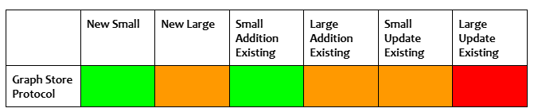

# Fuseki

[Fuseki](https://jena.apache.org/documentation/fuseki2/) is an [Apache Software Foundation](https://apache.org/) free and open source product that is part of the [Jena](https://jena.apache.org/) RDF framework. It is a database system that implements the [SPARQL Protocol](https://www.w3.org/TR/sparql11-protocol/) which means you can run Fuseki to expose RDF data.

KurrawongAI has extensive experience in deploying Fuseki for clients and can also provide a range of Fuseki support services. To find out more, visit our [website](https://kurrawong.ai/products/fuseki/).

This guide outlines the various Fuseki data loading methods available and provides detailed procedures for each.
## Contents

- [Data Loading Methods](#data-loading-methods)
- Data Loading Procedures
	- [SPARQL](#sparql)
	- [Kurra CLI - Graph Store Protocol](#kurra-cli-graph-store-protocol)
	- [tdbloader](#tdbloader)
	- [RDF Delta](#rdf-delta)
  
## Data Loading Methods

There are a number of tools/methods that can be used for loading data to Fuseki databases. Both the size of the database and the dataset being loaded will dictate which method is most suitable, as indicated in the Traffic Light Matrix and related notes below.

Refer to the [Data Loading Procedures](#data-loading-procedures) section for the detailed steps required for each loading tool/method.

**Traffic Light Matrix for data loading methods**


| *Matrix Notes:*                                                                                                                                                                                                                                                                                                                                                                                                                                                                                                                                                                                                                                                                                                                                                 |                                                                                                                                                                                                                                                                                                                                                                                                                                                                                                                                                                                                                                                                                                                                                                                                                                          |
| --------------------------------------------------------------------------------------------------------------------------------------------------------------------------------------------------------------------------------------------------------------------------------------------------------------------------------------------------------------------------------------------------------------------------------------------------------------------------------------------------------------------------------------------------------------------------------------------------------------------------------------------------------------------------------------------------------------------------------------------------------------- | ---------------------------------------------------------------------------------------------------------------------------------------------------------------------------------------------------------------------------------------------------------------------------------------------------------------------------------------------------------------------------------------------------------------------------------------------------------------------------------------------------------------------------------------------------------------------------------------------------------------------------------------------------------------------------------------------------------------------------------------------------------------------------------------------------------------------------------------- |
| 1. Can be verbose, useful for scripts inserting/creating small amounts of data.<br>    <br>2. Good option.<br>    <br>3. Running tdbloader and related set up can be more effort than it is worth for small datasets.<br>    <br>4. Setting up RDF Delta can be more effort than it is worth for small datasets.<br>    <br>5. Not recommended.<br>    <br>6. Has appeared to worked in the hundreds of MB but seems to cause issues with Fuseki.<br>    <br>7. Good option.<br>    <br>8. Good option.<br>    <br>9. Good option. May not have record of addition if query is not saved.<br>    <br>10. Good option.<br>    <br>11. Requires dataset to be offline, or performed on replica. Not worth the effort for small additions.<br><br>12. Good option. | 13. Not recommended.<br><br>14. Somewhere between 50 MB to 1 GB this is a bad idea.<br>    <br>15. Requires dataset to be offline, or performed on replica. Must run in append mode; slower than sequential loader. Cannot use xloader, so restricted in size.<br>    <br>16. Good option.<br>    <br>17. Good option. May not have record of update if query is not saved.<br>    <br>18. Can only update at the graph level (PUT).<br>    <br>19. Requires dataset to be offline, or performed on replica. Not worth the effort for small additions. Requires update to be written in SPARQL.<br>    <br>20. Good option.<br>    <br>21. Not recommended.<br>    <br>22. Not recommended.<br>    <br>23. Requires dataset to be offline, or performed on replica. Requires update to be written in SPARQL.<br>    <br>24. Good option. |

## Data Loading Procedures

### SPARQL

##### Scenarios
SPARQL is recommended as a method for small additions/deletions/updates to new or existing datasets. It is not recommended for large operations for both performance reasons (on large instances this may not be an issue), and also because the provenance of changes made to the database through SPARQL updates are not captured (unless specifically set up through an external process). 

One caveat is that SPARQL can be used with the tdbupdate command line utility to directly update large Fuseki TDB2 datasets, though the TDB2 dataset must be offline to do this.


##### Steps to accomplish
The [SPARQL Update specification](https://www.w3.org/TR/sparql11-update/) sets out a number of methods for updating RDF Data in Triplestores via update queries. These updates, deletes, or additions are done using the general patterns specified below, where “{ }” has been used to denote graph or triple patterns e.g. { GRAPH ?g { ?s ?p ?o } } or { ?s ?p ?o } (or equivalent expressions with IRIs or RDF Literals).

Insertion of new data “inline” i.e. directly specifying the data to insert:
```
INSERT DATA { }
```

Insertion of new data based on existing data in the dataset:
```  
INSERT { }
WHERE { }
```

Deletion of data “inline” i.e. directly specifying the data to delete:  
```  
DELETE DATA { }
```

Deletion of data based on existing data in the graph:
```
DELETE { }  
WHERE  { }
```

Update of data based on existing data in the graph:
```
DELETE  { }
INSERT  { }
WHERE  { }
```

### Kurra CLI - Graph Store Protocol

##### Scenarios
The Graph Store Protocol can be used in a range of scenarios, it is generally less preferred for larger datasets. While local uploads of large files have been done successfully this is not always reliable in cloud environments.



##### Steps to accomplish
You have a new Fuseki instance without any data in it, and you want to load in a small amount of data. You have already created a new Fuseki dataset named “ds” along with the following Fuseki endpoint permission in the Fuseki configuration file.

```
:service_tdb_all  
	a  fuseki:Service ;  
	fuseki:endpoint  [ fuseki:operation  fuseki:gsp-rw ] .
```

The above sets the Fuseki service with gsp-rw, which allows read and write operations on the unnamed Graph Store Protocol endpoint. Assuming the Fuseki instance is available at localhost:3030, the above “ds” dataset will be available at [http://localhost:3030/ds](http://localhost:3030/ds) with both read and write capabilities available.

Using [uv](https://docs.astral.sh/uv/) or a similar python executable manager, install the kurra CLI utility from https://github.com/Kurrawong/kurrawong-python.

> uv tool install [https://github.com/Kurrawong/kurrawong-python/archive/refs/tags/0.4.1.zip](https://github.com/Kurrawong/kurrawong-python/archive/refs/tags/0.4.1.zip)

The kurra command is now available. Use the **fuseki upload** subcommand to upload RDF data files to the “ds” dataset via the HTTP Graph Store Protocol.

`kurra fuseki upload background-resources/ http://localhost:3030/ds -u admin -p fuseki`

The tool can upload RDF data from both directories or individual files on the filesystem. In the above example, we are uploading all files from the *background-resources* directory.  

If Fuseki has been configured with a custom shiro.ini and it is protected by basic authentication, you can add the -u and -p flags to specify the username and password, respectively.

### tdbloader

##### Scenarios
The following scenarios are appropriate for use with the tdbloader command line utilities.


**Simple Deployments**
For simple deployments where RDF Delta is not required, the preferred data loading method is to use the Jena tdb2.tdbloader command line utility to generate the database files.

*Advantages*
- Fast for a large amount of data.
- It uses the same module that Jena uses internally to create database files but is decoupled from the HTTP server, and is thus faster because it does not need to allow for handling of requests while the generation is in progress.

*Disadvantages*
- Requires the orchestration of another component (the tdb2-generation image), and 
- is not preferable for making additions or updates to the data after the initial generation. And thus may only ever be used once.

##### Steps to accomplish
1. Install the [Jena command line tools](https://jena.apache.org/documentation/tdb2/tdb2_cmds.html)
2. Run the tdb2.tdbloader command (it takes RDF files as input and produces a TDB 2 database as output.)
3. Upload the database files to the location required for the deployed Fuseki instance. (for example, if Fuseki is deployed to a cloud VM, then the files must be copied to the cloud VM disk under `/fuseki/databases` or similar)
   
> **Note:** There exists the [tdb2-generation](https://github.com/kurrawong/tdb2-generation) image, which is a wrapper around these operations and more. It can also create the spatial and text indexes that may be required for the database.


### RDF Delta

RDF Delta is a system for recording and publishing a set of changes made to RDF Datasets in Fuseki. Its main goal is to provide a deployment stack that allows for a highly available Fuseki cluster that scales horizontally. 

The deployment stack follows a hybrid model between eventual consistency and a master-slave architecture where the RDF Delta Servers acts as the master, can receive writes in the form of RDF patch logs, and propagates them to the Fuseki instances, which are the slaves. A caveat to this master-slave architecture is that RDF Delta Servers can only receive RDF patch logs and not SPARQL Update queries. For this case, the SPARQL Update queries must be executed on the Fuseki dataset’s SPARQL endpoint whereby the query immediately updates the Fuseki database, generates a set of patch logs, and sends them to the RDF Delta Servers for further propagation.

##### Scenarios
RDF Delta is an appropriate solution for loading or updating all sizes of datasets, however, it requires more effort to set up than other methods. Once set up, a smaller amount of effort is required to write additional “producers” to update Fuseki.


**Complex deployments**
In many scenarios, it may be necessary to incorporate the RDF Delta system into the Fuseki deployment. In this case, the tdb2.tdbloader utility is not recommended for loading new datasets, as the patch log database is the source of truth rather than the tdb2 database.

*Advantages*
- This can be performed against the live server, and
- is the same way that data loading can be performed for additions and updates.
   
*Disadvantages*
- Not as fast as TDB2 loader for large volumes of data.

##### Submitting RDF patch logs to the RDF Delta Server

RDF Delta comes with a suite of [command line tools](https://afs.github.io/rdf-delta/cmds.html) that aid in performing actions against the RDF Delta Server, including adding new RDF patch logs.  

Append a new patch log to a dataset.
`dcmd get --server URL --dsrc NAME PATCH ...`

If you have an RDF file and not a patch log, you can use the r2p tool to convert an RDF file to a patch log.
`dcmd rdf2patch FILE`

The command line tools are just wrappers around an undocumented HTTP API. To aid in programmatically interfacing with the RDF Delta Server, use the [python rdf-delta library](https://github.com/Kurrawong/rdf-delta-python).

##### Submitting SPARQL Update queries to Fuseki

SPARQL Update queries are submitted exactly the same way as documented in the SPARQL Data Loading Procedure. The RDF Delta module in the Fuseki instance will handle the processing of the SPARQL query, generating patch logs, and submitting it to the RDF Delta Server in the background.

##### RDF Delta and Event Sourcing

This section speaks to an event-driven architecture where the event sourcing pattern is the primary method of updating the system’s state. 

In an event sourcing system, it is critical for all update actions that mutate the system’s state are processed through the event stream and persisted in the event broker. The event stream becomes a firehose of real-time information that can be used for auditing and analytical purposes, or be replayed as part of the data restore process. The event stream also serves as a way for other systems to hook into and be notified when certain interesting changes are made to the system. Additionally, the event stream also provides a straightforward way to add additional middleware layers when business requirements change without having to rewrite or re-architect the system as a whole.  

There may be multiple event streams in the data flow, but there’s usually just one main topic that all producers use as the API to submit changes to the system. This API must establish a message specification where all producers and consumers must conform to. A message generally has a set of standard headers described using the vocabulary and structure in [ladb-schemas - Patch Log Header Example](https://spatial-information-qld.github.io/ladb-schemas/#PamnVMBU) with a message body containing actual content (such as delta changes, or RDF payload) or a URL to a large payload in external storage. This specification will be pulled out of the QLD spatial information system and reused in other projects in the future.
###### Message - RDF patch log

**Header:**
	application/rdf-patch

**Description:**
	Raise an error. RDF patch logs require the previous patch log identifier in the patch log header. The previous patch log identifier may not be valid by the time the message is consumed and sent to the RDF Delta Server. Producers must submit RDF patch logs in the “RDF patch body” format.

###### Message - RDF patch body

**Header:**
	application/rdf-patch-body

**Description:**
	The mime type is informal but is required to inform consumers that the content is a valid RDF patch log body but is without the required header information. Consumers must retrieve the latest RDF patch log identifier, attach it to the current patch log header, and submit it to the RDF Delta Server. Suggested identifier regime is to generate a UUID version 4.

###### Message - RDF Turtle

**Header:**
	text/turtle, application/n-triples, application/ld+json, etc. This should include all official triple and quad serialisation formats.

**Description:**
	The RDF payload is converted into an RDF patch log with all statements as “append” and sent to the RDF Delta Server.

###### Message - URI list

**Header:**
	text/uri-list

**Description:**
	The message body consists of a line-separated listing of URLs of the location of the RDF patch log or payload. The consumer performs a request to each URL, processes it, and submits it to the RDF Delta Server.

> **Note:**
> This specification is currently incomplete. Ideally the header also contains metadata about the kind of mime type of each URL. It may be a requirement that all documents at each URL must be compressed using a specific compression algorithm  to reduce data transfer bandwidth.


###### Message - SPARQL Update

**Header:**
	application/sparql-update

**Description:**
	A SPARQL Update query. The consumer must send this to the Fuseki SPARQL Update endpoint, which will update the Fuseki database state, and propagate the changes back to the RDF Delta Server.
