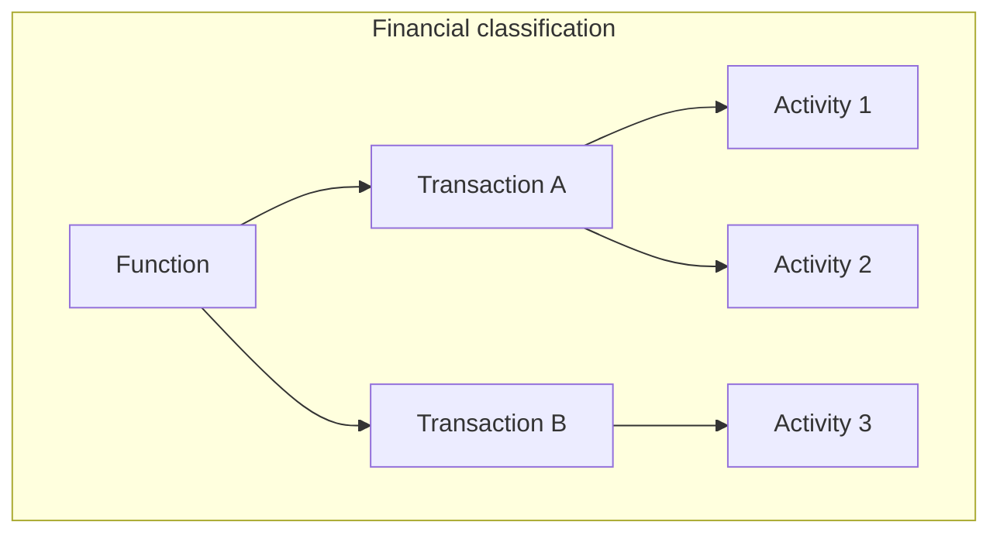
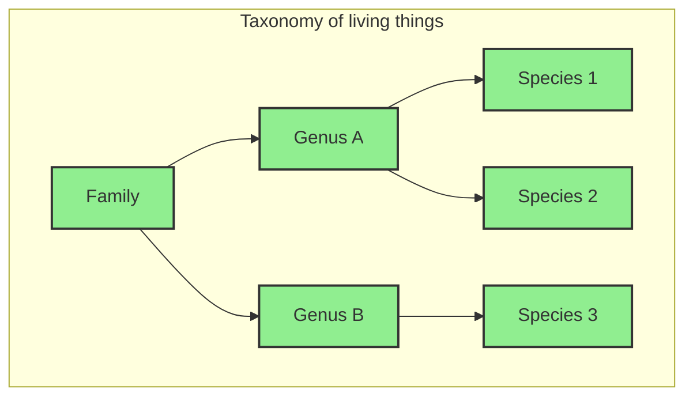
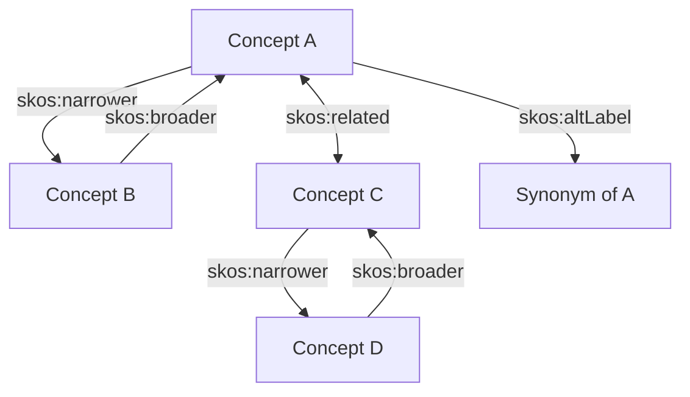
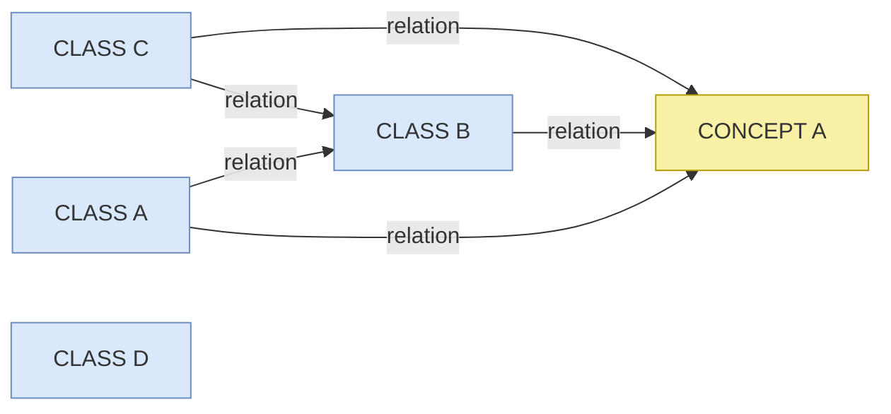
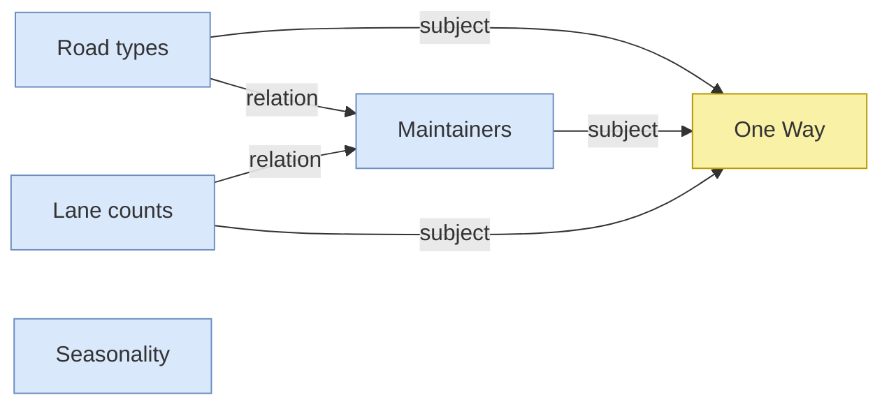
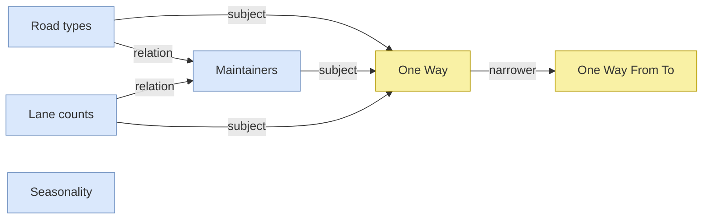
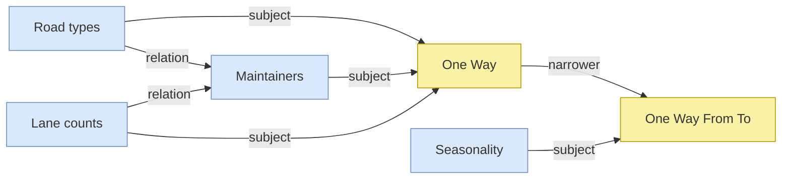
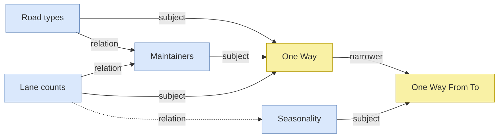

# Vocabulary Management


>
>***Scope***
>
>This content is in intended to provide guidance on the creation and management of vocabularies in the context of Knowledge Graph data management. It will explain why vocabs are important; summarise key aspects; and introduce helpful tools. 

>
>***Audience***
>
>_While content does provide summary explanations of the benefits and importance of good vocabulary management practice, it is primarily targeted to managers and users (vocab owners and contributors) of established vocabularies. It is assumed that learners have some experience with using document management or version control systems, and general familiarity with data management in practice._
>
>***Outcome***
>
>_These modules are intended to provide an introduction to vocabulary creation and management, and provide initial guidance on best practice for administration and management of vocabularies within part of broader data management systems. It is recommended that users independently access other resources (see references [here](#references-and-further-reading)), as part of ongoing independent learning._
>
>----------------

💡 _Identifies troubleshooting tips, common errors and potential issues._

> 📝 _Notes that summarise content at the end of a module._


## An Introduction to Vocabularies
As languages speakers, we have developed the categorization of "things" as a means to both understand and communicate our experience of the world. The sheer volume of data that we interact with has necessitated approaches to using our shared understanding of language and naming. Particularly when using information as part of large-scale data holdings, it can be beneficial to encourage consistency through the use of controlled vocabularies.

When sharing information across diverse groups of people (or perhaps software applications), there is need for a common understanding of exactly what is being referred to. This is where controlled vocabularies provide a structure from which terminology applied to information can be driven from an agreed stated understanding of that concept. That understanding can be a definition for human understanding, or a machine-readable unique identifier for machine processing.

Whatever size and shape, the vocabularies mentioned in these modules are designed for describing data and content. Vocabularies can be used to describe (or catalogue) content in information systems. Vocabularies can also optimise search engines and provide the basis for navigation in information systems, making it easier for users to find content and data.

## Vocabulary types

In this section we will introduce some common vocabulary types. By introducing simple and more complex vocabulary examples we will introduce some important vocabulary features.

### Glossary
* defining terms

Glossary are a very common form of vocabulary found in many print and web resources. A glossary is a list of concepts, expressed by natural language terms (we will refer to _terms_ and _labels_ interchangeably) with added definitions.

  

Each concept in a Glossary has at least one label and one definition. Some glossaries include _see_ references that direct a user to a preferred term. This _equivalence_ mapping is a common feature in more complex vocabulary types such as in a **thesaurus** that we will look at below. But first we will look at vocabularies that include hierarchy relationships.

### Taxonomies
* a very short history

Taxonomies are vocabularies with hierarchical relationships between concepts. Conventionally, we might say that concept A is _broader_ than concept B, when the _all-some_ rule apples: All B's are A, and some A's are B. For example, _all apples are fruit, and some fruit are applies_. Therefore, _fruit_ is broader than _apples_.

Modern taxonomies that are used to organise and retrieve data owe their heritage to two disciplines: biology, or the taxonomy of living things, featuring familiar concepts of class, family, genus, species etc..., and financial classifications, where concepts are typically categorised as either function, activity of transaction.


The definition, or meaning of a given term is given, in part, by its relationship to broader and narrower terms. For example, we have a clearer understanding of what _crane_ means if it has a broader relationship with _birds_ (and not _construction equipment_).

<br>



We will see below in [Vocabularies in the context of knowledge graphs](#vocabularies-in-knowledge-graphs) how the broader / narrower relationship between concepts can improve search and extraction functions in data where vocabularies are used to enrich data.
<br>

### Thesaurus 
* a (more) complete picture

The modern retrieval thesaurus combines the structure of a taxonomy with an additional non-hierarchical relationship and also synonym control. Thesauri establish _hierarchy_, _association_ and _equivalence_ between terms. Each can be expressed using the Simple Knowledge Organization System (SKOS) properties `skos:broader` / `skos:narrower`; `skos:relation`; and `skos:prefLabel` / `skos:altLabel` ([W3C, 2009](#references-and-further-reading)).



> 💡 **Tip:** the ``skos:related`` property is most useful for relating disparate concepts in deep, complex hierarchies. Use ``skos:related`` sparingly - don't relate everything to everything! 

We will look at SKOS properties in more detail in the [Properties](#vocabulary-properties) section.

### Vocabularies in knowledge graphs

Thought of as an interconnected system of data classes, a knowledge graphs may involve vocabularies as an additional class that will connect with some or all other classes. In a knowledge graph, a vocabulary concept can be modelled as just another class. 

One function that vocabularies serve is to supplement and fill semantic gaps in data relations. In the example below, classes A, B an C are each related to each other in some way. Class D is not related to other classes. A concept from a vocabulary is also included, and has relationships to classes A, B and C.



The relationships between classes and concepts is often of a _subject_ nature - that is to say the class instance is _about_ the concept.


Now we will look at a domain example using possible interrelationships between spatial data classes, focusing on roads.



The concept ``One Way`` comes from ``Road directions`` vocabulary, where the concept ``One Way From To`` may be defined as a `skos:narrower` concept.



Let's assume that the ``Seasonality`` class contains data profiled with the ``One Way From To`` directional roads concepts. So there is also a relationship with the `skos:narrower` concept provided in the vocabulary. This hierarchy relationship in the vocabulary then provides a bridge between classes of information.



Because of this relation between concepts in the vocabulary, it's possible to make an inference that connects classes that were previously unrelated, such as between ``Lane counts`` data and ``Seasonality`` data.


Let's put this into a narrative form:

_We know that some roads are closed on a seasonal basis, but we don't know what portion of these are one lane roads. But we do have data about the seasonality of 'One Way From Two' roads, also called 'One way with vector' roads. Because these roads are defined as a type of One Way road [defined as `skos:narrower`], we can infer information about seasonal road closures for one lane roads._


## Vocabulary properties

Vocabularies contain, as a minimum: _labels_, _definitions_ and _identifiers_

We have already introduced concepts and their relation properties to other concepts. In this section we will look at more concept properties, including properties that are required for validation in vocabulary quality standards.

To comply with VocPub profile ([AGLDWG, n.d.](#references-and-further-reading)), each concept must have at least:

- a `skos:prefLabel` which is the main way that we say and understand the concept;
- a `skos:definition` - a short note that describes the concept;
- an _Identifier_ - a unique way of distinguishing the concept from other concepts

In order to enrich your data environments, it is also recommended to include:

- `skos:altLabel` - additional textual label(s) that also represent the concept where available, and 
- `skos:broader` - hierarchical relationships between concepts, where the all-some rule applies (discussed in the [Taxonomies](#taxonomies) section).

As you might expect, preferred and alternative labels are derived from natural languages. All Concept Labels should have a language tag from a widely used system (ISO 639-1 is commonly used) - so a concept may have English label "Apples@en" and/or French label "Pomme@fr" for the same concept. 

> 💡 **Tip:** Vocabularies that include more than one language tag are sometimes called _multilingual_ vocabularies.

> 💡 **Tip:** Depending on the vocabulary editor in use, language tags may be assigned automatically, or you may have to add them manually.

Let's take a closer look at why we call some labels _preferred_ and others _alternative_.

### Preferred labels

Each concept must have at least one _Preferred label_ (``skos:prefLabel``), based on the word or phrase that best describes the concept. We often use different terms to mean the same thing - the ``skos:prefLabel`` should be the term that is used most frequently, or understood and used by most expected users of a system or catalogue.

### Alternative labels

Each concept may have _Alternate labels_ (``skos:altLabel``). It's a good idea to add one or more ``altLabel`` to a concept so that it can be found in different ways. A concept can have any number of alternate labels, provided they are similar enough to the common understanding of the concept.

💡 **Tip:** when adding a `skos:altLabel`, ask this question: _If I searched with a preferred label, and found some information matching an alternative label in the text, would I be satisfied by the search result?_

Here are some common scenarios where we might need to choose between preferred and alternative labels:

#### Common vs Scientific terms

Connect scientific or technical names with common names. For example:

- Red imported fire ant ``skos:altLabel`` Solenopsis invicta
- Boghead Coal ``skos:altLabel`` Torbanite

#### Superseded terms

Even if a term is no longer used in recent content, users may still search a catalogue using superseded language. Storing superseded terms as alternative labels helps to group content that contains antiquated language with content written in current language. For example:

- Aeolian Sand ``skos:altLabel`` Eskimo Sand
- Utility hole ``skos:altLabel`` Manhole

#### Acronyms vs phrases

In general, an acronym or initialism should be managed as an ``skos:altLabel``; example: 

- Greenhouse gasses ``skos:altLabel`` GHG 

An exception is when the acronym is better known or more frequently used. For example:

- TNT ``skos:altLabel`` Trinitrotoluene
- CSIRO ``skos:altLabel`` Commonwealth Scientific and Industrial Research Organisation

#### Official vs common language

Use an ``altLabel`` to connect official or technical language with natural language. For example:

- Bi-directional ``skos:altLabel`` Two way
- Alcohol-impaired driving ``skos:altLabel`` Drink-driving

### Identifiers

Each concept must have a unique identifier that can be looked up in an application or on the web. An IRI, or _Internationalized Resource Identifier_, is a recommended identifier type for vocabulary concepts. 

IRIs are web page URLs that:

- can be used in data to identify things without necessarily resolving to a web page
- can be managed with domain name ownership
- allow for a specified range of characters, e.g. non-English alphabets
- have validation rules similar to web address (URL) rules, e.g. no spaces

An IRI typically follows a pattern such as:

``http:// [vocabulary subdomain] . [authority / domain] . [vocabulary name] . [concept ID]``

Here's a real example from a published vocabulary:

``http://vocabulary.curriculum.edu.au/scot/15326``

... where:

    _vocabulary_ is a subdomain
    _curriculum.edu.au_ is a managed or owned domain
    _scot_ is an identifier for the whole vocabulary, and
    _15326_ is a concept ID

#### IRI patterns

What is the name of the concept above that has _15326_ as an identifier? You need to look it up on the web! The whole point of using ``http`` identifiers is so that the concepts can be looked up on the web by anyone, anywhere (and by anything - humans, browsers, bots etc.).

Note that this IRI uses an increment method for generating a concept ID - the next concept IRI added to this vocabulary would have the suffix _15327_. This incremented number doesn't mean anything - we can't tell what the concept is about just by looking at this number. Any vocabulary could use this same increment method, and therefore this ID would appear for concepts in different vocabularies. The IRI as a whole, however, is unique.

Here's a second method for generating an IRI suffix:

``http://vocabulary.curriculum.edu.au/crossCurriculum/f7f47140-a85e-498b-9367-0d468082fc2b``

The suffix here is a UUID, or a _Universally Unique Identifier_. Note that if we took the UUID out of context (away from the whole IRI), we could consider it to be unique on its own terms - UUIDs are designed that way. 

**Tip:** UUID are not registered and can be generated by anyone using [online tools](https://www.uuidgenerator.net).

A third _NOT RECOMMENDED_ method for constructing a concept ID is to base the ID on whatever ``prefLabel`` has been chosen. This has the advantage of making the IRI itself readable and understandable by humans - but there are several disadvantages also and the preferred label method should be avoided if possible.

``https://data.idnau.org/pid/vocab/org-indigeneity/run-by-indigenous-persons``

... where:
"/org-indigeneity/" is the ID for the vocabulary, and
"/run-by-indigenous-persons/" is the ID for the concept

What if the prefLabel for this concept changes to "_Managed_ by indigenous persons"? The IRI stays the same (they should be persistent), and now doesn't match (exactly) the ``prefLabel``. A similar problem is encountered if the concept has multiple ``prefLabel`` in different languages - which one should be used? IRIs are more robust if their concept IDs are opaque (they don't say anything about the concept itself).


### Broader / Narrower

We have already introduced the ``skos:broader`` and ``skos:narrower`` relationships in the sections above on taxonomies and thesaurus vocabularies. 

Depending on the type and complexity of a vocabulary, there may be a requirement that all concepts are related to another concept via ``skos:broader`` property. In a taxonomy or thesaurus vocabulary project, a concept that does not have a skos:broader concept may be considered an _orphan_, unless it is a ``topConcept``. As far as the SKOS standard is concerned, there is no need for all (or any) concepts to be arranged in a hierarchy. In some cases a vocabulary will be mostly flat with selected concepts in narrower relationships to broader concepts.

If a skos:concept does not have a skos:broader property, the VocPub profile requires that it must reference the relevant skos:conceptScheme IRI with the ``skos:topConcept`` property. 

**Tip:** Broader and narrower relationships are reciprocal - that is, if A is broader than B, then B is narrower than A. For example:

- Dynamic land cover ``broader`` Land cover and land use
- Land cover and land use ``narrower`` Dynamic land cover

- Apples ``broader`` Pomme fruit
- Pomme fruit ``narrower`` Apples

- Hospitals ``narrower`` Private hospitals
- Private hospitals ``broader`` Hospitals

Arranging concepts into a hierarchy supports discovery via:

- _Search expansion_ - a search system can add results that match narrower concepts of a search term. For example a search for _Granitoid_ would return resources about _granitoid_ OR _granite_
- _Navigation_ - top-down navigation or breadcrumb links can be launched in an interface using broader/narrower relationships. For example, clicking on _Pomme fruit_ launches a list of links to apples, pears and quinces

In a vocabulary, it's possible to keep adding narrower relationships by creating more and more specific concepts. For example, a catalogue that is about horticulture probably needs a vocabulary with more specific (narrower) concepts than just _apples_ (e.g. _Kiku Fuji_).

💡 **Tip:** Only add narrower concepts that you would expect to be used to describe content in a catalogue, and distinguish that content from others, with that concept. Don't make a vocabulary hierarchy very deep with specific concepts just because you can!

###  Top Concepts

If a `skos:concept` does not have a `skos:narrower` relationship, it is automatically assumed to be a `skos:topConceptOf` a `skos:conceptScheme` and must be declared as such.

## Notes

Note fields are available for each concept. A _definition_, such as found in a glossary, is required by VocPub ([AGLDWG, n.d.](#references-and-further-reading)). A definition is not intended to be an exhaustive treatment of a concept, but rather explains the scope and usage of the concept.

A `skos:historyNote` is a useful property for vocabulary managers to track decisions that have been made about a concept (label changes, new broader relationships). It can also be used to make a statement about the origin of a concept.

💡 **Tip:** When writing notes, use plain text only and limit paragraph breaks where possible.


## Concept scheme

A Concept scheme is some metadata about the vocabulary as a whole - the vocabulary title (`skos:prefLabel`), a definition (`skos:definition`), and a unique identifier are minimum requirements. All vocabularies must have a Concept scheme, and the Concept scheme should include:

- an Identifier - create an IRI following the same pattern as the IRIs for concepts. For the suffix, instead of a concept ID, add a Concept scheme ID. This may be the name of the Concept scheme (the vocabulary), e.g.: - ``https://linked.data.gov.au/def/road-types``
  ... _where Road types_ is the name of the concept scheme.

- a [Preferred label](http://www.w3.org/2004/02/skos/core#prefLabel) - the same property that is used for a Concept. Use a Preferred label for the name or title of the vocabulary (this may also be used for the Concept scheme ID)
- a [Definition](http://www.w3.org/2004/02/skos/core#definition) - a definition of the Concept scheme. Use plain text only but paragraphs may be separated by newlines. Also used for Concepts
- a [Created](http://purl.org/dc/terms/created) date. When the Concept scheme was first created. This might be automatically created by a vocabulary editor
- a [History](http://www.w3.org/2004/02/skos/core#historyNote) note - a note on the origin or history of a vocabulary - such as how or from what it was generated.

## Mapping concepts with concepts in other vocabularies

In the basic structure of a vocabulary, concepts may be related to other concepts via broader, narrower or related properties. Sometimes a concept needs to be related to a concept in a _different_ vocabulary. Concept matching across vocabularies is done in a similar way but with different properties: [Broad match](http://www.w3.org/2004/02/skos/core#broadMatch), [Narrower match](http://www.w3.org/2004/02/skos/core#narrowMatch), [Related match](http://www.w3.org/2004/02/skos/core#relatedMatch).

Broad match example:

_Limestone packstone_ `skos:broadMatch` _Packstone_
... where _Limestone packstone_ is a concept in the [GSWA rock classification scheme](https://linked.data.gov.au/def/gswa-rock-classification-scheme), and _Packstone_ is a concept in the [INSPIRE code list register](http://inspire.ec.europa.eu/codelist).

Exact match example:

Child support `skos:exactMatch` Child support
... where _Child support_ is a concept in both [Public Policy Taxonomy](https://linked.data.gov.au/def/policy/0acd51d0-a4a3-48eb-b6f4-aa086f966057) and [FAST](http://id.worldcat.org/fast/854679).

## Collections

There may be a need to define a group of concepts within a vocabulary that share common characteristics. A vocabulary may contain a collection, or even many collections of concepts.

Collections are like a non-hierarchical means of gathering Concepts. Collections allow you to group Concepts in ways differently to the `skos:conceptScheme` that you create them in. So for example concepts that are members of a Collection may be from different part of a vocabulary hierarchy (and not all broader-narrower parts of a hierarchy branch).

A `skos:collection` references a `skos:concept` using the `skos:member` property.

## Optional elements
You can add more metadata to your Concepts and Concept schemes that will improve the clarity, scope and provenance of your vocabulary. Consider the following additional elements:

### Version

Version number or code for this vocabulary e.g. 1.1. A [version IRI](https://www.w3.org/2002/07/owl#versionIRI) may be used, example:
- IRI: https://linked.data.gov.au/def/address-alias-type
- `prefLabel`: Address Alias Type
- `VersionIRI`: https://linked.data.gov.au/def/address-alias-type/1.0

### Citation

Use the [Citation](https://schema.org/citation) element to provide an optional hyperlink to or textual description of source information.

### Derived from

Use [derived](http://www.w3.org/ns/prov#wasDerivedFrom) from to reference an IRI for an external vocabulary from which the vocabulary is derived.

### Derivation mode

A Derivation mode value is mandatory if a value is given for the `prov#wasDerivedFrom` property. Derivation mode concepts are selected from the [Vocabulary Derivation Modes](https://linked.data.gov.au/def/vocdermods) vocabulary.

### Notation

All concepts must have an IRI, and the IRI identifier may be a completely opaque string based on nothing other than a randomly generated string (such as from the UUID scheme). However, concepts may optionally store a `skos:notation`, which is like a secondary identifier and is based on some source or reference data that the concept was derived from.

### Defining vocabulary IRI

A concept may be 'imported' from another vocabulary. We can assume that a concept is imported if it shares the same or very similar metadata (such as a `skos:definition`) and labels. Such concepts should indicate the [defining](http://www.w3.org/2000/01/rdf-schema#isDefinedBy) vocabulary from where they were imported. Read more about [importing](#Adoption) concepts and references. 

### Citation

For each concept, a [Citation](https://schema.org/citation), an optional reference to or textual description of some source information, may be given.

Example:

    IRI: https://data.idnau.org/pid/vocab/policy-types/policy
    prefLabel: policy
    definition: A strategic directive and high-level description of desired behaviour developed by an organisation to help govern how it functions...
    citation: https://policy.usq.edu.au/documents/14266PL

... where the Citation refers to a policy definition originating from an external source. In this example the URL of the source is given so that it can be easily looked up and, if needed, verified and validated.

## Vocabulary tools

Getting source data into a portable reusable format will go more smoothly with the right tools. 

KurrawongAI supply free vocabulary editing tools that require no client-side installation, and any vocabulary data created is not stored on a server. An _MS Excel_ based tool and web based form can be used to create vocabulary data in SKOS RDF and serialised in Turtle ([W3C, 2014](#references-and-further-reading)) format. See the KurrawongAI [Tools](https://tools.dev.kurrawong.ai) page to access VocExcel. KurrawongAI is also developing a browser-based tool (see [VocEdit](#vocedit)).

Vocabulary editing tools are also available from [Research Vocabularies Australia](https://vocabs.ardc.edu.au). Users must register for access to RVA tools.

Both the KurrawongAI and RVA tool options will support creation and management of vocabulary terms, term relationships as defined by the SKOS standard and IRI generation.

One consideration for choosing editing tools relates to the expected complexity of a vocabulary, especially with respect to the amount of hierarchy. Will the vocabulary be a _flat_ list of terms, or will the vocabulary include broader/narrower relationships between terms? A flat list, or a smaller vocabulary that does not have deep hierarchies may be created using a spreadsheet type application such as VocExcel. Multi-level vocabularies will probably need VocEdit or the RVA Editor.

If you're building a vocabulary _from scratch_, and it's not clear yet what vocabularies will be based on, you may not know yet how complex or deep the vocabularies will be. You can start with something like the VocExcel tool, and migrate to another application by exporting a Turtle file that can be imported into VocEdit[](#vocedit) or the RVA Editor.

### VocEdit
VocEdit is a browser-based app for creating and editing vocabularies. VocEdit:
- supports vocabulary alignment with the VocPub specification
- is extensible - add other properties as needed
- supports generation of deep, complex taxonomy structures where needed

VocEdit does not store vocabulary data in a database - it simply creates a file that can be edited and stored locally. When a project is updated and saved, the local file gets updated. Therefore, a file versioning and management approach, such as Git, is recommended for VodEdit projects.

### Edit with VocEdit

We will edit the <a href="https://linked.data.gov.au/def/road-travel-direction" target="_blank" rel="noopener noreferrer">Road Travel Direction</a> vocabulary.

- download the _VocPub > Turtle_ file to your desktop
- Open <a href="https://vocedit.dev.kurrawong.ai/" target="_blank" rel="noopener noreferrer">VocEdit</a> in _Chrome_ browser.
- Project > Open
- Navigate to the ``road-travel-directions.ttl`` file > open
- Select ''One Way From To''
- Open _Concept relationships_
- Open options for _Broader_
- Select _Add an IRI value_
- From the new dropdown box, select (or search for) _One way_
- Select the 'Tick' button
- Project > Save
- Navigate to the ``road-travel-directions.ttl`` file > open and note change to the file - there is a new ``skos:broader`` relationship.

### Validate a vocabulary

We will test the file that we just edited using a KurrawongAI <a href="https://tools.dev.kurrawong.ai/validate" target="_blank" rel=noopener noreferrer">SHACL validation</a> tool.

- paste the turtle code into the editor (or upload the file)
- select validators > VocPub > [latest version] validator
- Validate! > Data is conformant.
- Edit the data: remove ``skos:definition`` from ``skos:conceptScheme`` triple.
- paste the edited turtle code into the editor
- Validate > _1 violation!_. Note that details of the relevant specification are given in the warning.


## Reuse existing vocabularies

It's worth checking if there are existing vocabularies (published by a third party) that match your requirements. In this section we will discuss:
- finding and identifying vocabularies for reuse
- workflows to suit vocabulary formats
- derivation modes: the type and extent of reuse
- how to indicate provenance and attribution

### Finding vocabularies to reuse

There may be vocabularies available for reuse listed in vocabulary registries:

- [Research Vocabularies Australia](https://vocabs.ardc.edu.au): vocabularies span a wide range of research and industry domains. Vocabulary search can be filtered by format and licensing, and many may be accessed directly from the RVA site via download or API.
- [BARTOC.org](https://bartoc.org): this is an international registry of vocabularies and ontologies in many languages and with over 2,500 records. 
- [Linked Open Vocabularies](https://lov.linkeddata.es/dataset/lov/): a community-curated catalog of RDF vocabularies used in Linked Data communities. LOV provides metadata, usage statistics, and interlinking information for vocabularies.
- [ID.LOC.GOV - Linked Data Service](https://id.loc.gov): the Library of Congress vocabularies widely used, especially for describing bibliographic data.

### Rights and licensing

Check an existing vocabulary for rights and licensing statements. Information about terms and conditions should be stated within the `skos:conceptScheme`, but might be stated outside the vocabulary data in a non-semantic resource (such as a vocabulary landing page). Some properties to check for include:
- `sdo:license` / `dcterms:license`
- `dcterms:accessRights`
- `sdo:copyrightHolder` / `isorole:rightsHolder`

**Tip:** Even if a vocabulary may be reused, some attribution may be needed in your local context. If derivations to the vocabulary are planned, they may need to be shared as a condition of reuse.

### Reuse non-semantic vocabularies

Building a vocabulary from scratch, with the editing and validation [tools](#vocabulary-tools) mentioned here, ensures vocabularies are well-formed and presented. Existing vocabularies published in other contexts may not be so well-formed! Existing vocabularies, including those found via vocabulary registries, will vary in their conformance with data standards such as RDF and SKOS, before even considering quality standards like VocPub and qSKOS ([W3C, n.d](#references-and-further-reading).). Here are a couple of challenges to consider:

- Unstructured: an existing vocabulary is well presented by not machine-readable, such as in PDF or HTML. The vocabulary terms may indicate properties and relationships, but these properties themselves are not machine-readable. The vocabulary may need to be scraped and cleaned, eventually transformed into an RDF format compatible with a SKOS editing tool.
- Unidentified: a vocabulary with labels but no identifiers - new IRIs will need to be constructed in this case. 

**Tip:** When constructing IRIs for an existing vocabulary, base the IRI suffix on any existing identifiers or tokens that may be present in the vocabulary. 

## Derivation modes

Consider the extent and type of derivation, there will be different requirements and implications for using existing vocabularies

### Verbatim

While using an existing vocabulary as-is requires no editing work, there will usually be a need to attribute the creator or publisher within your local business context.

### Customisations

Minor changes may be made to vocabularies to meet local requirements. Vocabulary concepts may be added; labels may be updated (changes to spelling or swapping an `skos:altLabel` for `skos:prefLabel`). Changes will need to be acknowledged at both the concept and concept scheme level.

### Adoption
Importing a cluster of concepts from an existing vocabulary into a local vocabulary project. The [provenance](#provenance-of-existing-vocabularies) of adopted concepts must be stated.

Example:

We will import a concept from the [LOD SRTI DATEX II](https://cef.uv.es/lodroadtran18/def/transporte/dtx_srti/) ontology into the <a href="https://linked.data.gov.au/def/road-travel-direction" target="_blank" rel="noopener noreferrer">Road Travel Direction</a> vocabulary.

_LOD SRTI DATEX II_ models 'Named individuals', which are enumerated instances of various properties. For example, the property ``srti:DirectionEnum`` has member the named individual ``srti:clockwise``. We will import model this named individual as a skos:concept and import it into the Road travel direction vocabulary.

To import the concept we will need to update the prefix declarations and `skos:conceptScheme` and add a new `skos:concept` and `skos:collection`

- Open the VocPub Turtle file used in the [editing steps](#edit-a-vocabulary-with-vocedit) in a text editor.

- Add `srti` to the prefixes:

```sparql
PREFIX : <https://linked.data.gov.au/def/road-travel-direction/>
PREFIX agldwgstatus: <https://linked.data.gov.au/def/reg-statuses/>
PREFIX cs: <https://linked.data.gov.au/def/road-travel-direction>
PREFIX dcterms: <http://purl.org/dc/terms/>
PREFIX droles: <https://linked.data.gov.au/def/data-roles/>
PREFIX owl: <http://www.w3.org/2002/07/owl#>
PREFIX prov: <http://www.w3.org/ns/prov#>
PREFIX reg: <http://purl.org/linked-data/registry#>
PREFIX sdo: <https://schema.org/>
PREFIX skos: <http://www.w3.org/2004/02/skos/core#>
# Added new prefix "srti":
PREFIX srti: <https://cef.uv.es/lodroadtran18/def/transporte/dtx_srti/>
PREFIX themes: <https://linked.data.gov.au/def/fsdf/themes/>
PREFIX xsd: <http://www.w3.org/2001/XMLSchema#>
```

- Add the following ``skos:concept`` and properties:

```turtle
srti:clockwise
    a skos:Concept ;
    dcterms:created "XXXX-XX-XX"^^xsd:dateTime ;
    dcterms:creator <http://editor.example.com/foo> ;
    dcterms:modified "XXXX-XX-XX"^^xsd:dateTime ;
    dcterms:definition "A rotational direction that moves in the same pattern as the hands of a clock" ;
    skos:topConcept cs: ;
    skos:prefLabel "Clockwise"@en ;
```
- Add the concept to the ``skos:conceptScheme``

```turtle
  cs:
    a skos:ConceptScheme ;
    sdo:keywords themes:transport ;
    dcterms:created "2023-05-30"^^xsd:date ;
    dcterms:creator <https://linked.data.gov.au/org/qsi> ;
    dcterms:identifier "road-travel-direction"^^xsd:token ;
# Date modified will be incremented:
    dcterms:modified "XXXX-XX-XX"^^xsd:date ;
    dcterms:publisher <https://linked.data.gov.au/org/icsm> ;
    reg:status agldwgstatus:experimental ;
    owl:versionIRI :1.0 ;
    owl:versionInfo "1.0" ;
    skos:definition "This vocabulary describes the travel direction assigned to a section of a road. "@en ;
    skos:hasTopConcept
        :bi-directional ,
# Added new concept "clockwise":
        :clockwise ,
        :none ,
        :one-way ,
        :one-way-against-vector ,
        :one-way-with-vector ,
        :unknown ;
# History note extended
    skos:historyNote "This vocabulary was created by the Queensland Spatial Information services and imports some concepts from other vocabularies" ;
    skos:prefLabel "Road Travel Direction"@en ;
    prov:qualifiedAttribution
        [
            prov:hadRole droles:custodian ;
            prov:agent <https://linked.data.gov.au/org/icsm>
        ] ;
```

- Create new ``skos:collection``

```turtle
:srti-vocabulary
    a skos:Collection ;
    dcterms:source "https://cef.uv.es/lodroadtran18/def/transporte/dtx_srti/"^^xsd:anyURI ;
    rdfs:isDefinedBy cs: ;
    skos:definition "Concepts from the LOD SRTI DATEX II ontology" ;
    skos:inScheme cs: ;
    skos:member
        <http://cef.uv.es/lodroadtran18/def/transporte/dtx_srti#clockwise> ;
    skos:prefLabel "LOD SRTI DATEX II"@en ;
    prov:wasDerivedFrom <https://cef.uv.es/lodroadtran18/def/transporte/dtx_srti/> ;
.
```

- **Select** "One Way From To"
- **Open** Concept relationships
- **Open** options for Broader
- **Select** Add an IRI value
- **From** the new dropdown box, select (or search for) "One way"
- **Select** the Tick button
- **Go to** Project > Save
- **Navigate** to the `road-travel-directions.ttl` file, open it, and note that there is a new `skos:broader` relationship.


# References and Further Reading

* AGLDWG. (n.d.). VocPub profile specification. Retrieved April 17, 2025, from https://agldwg.github.io/vocpub-profile/specification.html
* W3C (n.d.). QSKOS. Retrieved March 5, 2025, from https://www.w3.org/2001/sw/wiki/QSKOS
* W3C (2009). SKOS reference. https://www.w3.org/TR/skos-reference/
* W3C (2014). Turtle: Terse RDF triple language (W3C Recommendation). Retrieved from https://www.w3.org/TR/turtle/