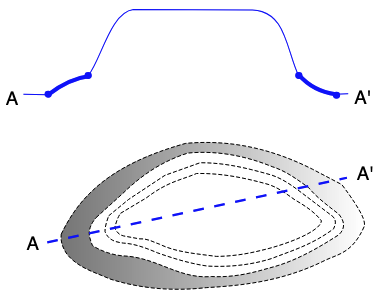

# Agent Patterns

> ***Scope***
>
> This content is in intended to convey Best Practice patterns in agent authority content

>
> ***Audience***
>
> Technical vocabulary creators.
> 
> All the patterns documented here assume the use of [Semantic Web](https://en.wikipedia.org/wiki/Semantic_Web) methods for data management and access. 
>
> ***Outcome***
>
> Technical vocabulary creators should learn both what KurrawongAI considers to be Best Practice for certain aspects of agent authorities and also how KurrawongAI and other agent creation and publication tools support the pattern.
>
> ---

## Identifiers

_What kind of IRIs should we mint for agents?_

### Context

Agents, be they individual persons or organizations, do not have unique names and should be uniquely identified.

### Solution

Yes we can base agent identifiers on two approaches:

1. using a pre-arranged common pattern mandated in your catalogue profile
2. reusing an existing known identifier for that agent 

#### Mandated identifier patterns

e.g. 
- Catalogue specific pattens, e.g. https://data.idnau.org/pid/organization/18d04115-4633-4aed-b164-ac3c209b4307
- CMS regulated patterns, e.g. Drupal - https://apo.org.au/person/330188
- 

#### Reusing identifiers

If an agent has an existing known identifier, you can reuse that in whole or in part for your agent record.

Some widely used agentic systems that mint identifiers include:

- ORCID
- Research Organization Registry (ROR)

e.g.

```turtle
PREFIX id: <http://id.loc.gov/vocabulary/identifiers/>
PREFIX sdo: <https://schema.org/>

<https://orcid.org/0000-0001-5640-3202>
    a sdo:Person ;
    sdo:honorificTitle "Mr" ;
    sdo:memberOf <https://data.idnau.org/pid/org/dewr> ;
    sdo:url "https://www.researchgate.net/profile/Les-Kneebone"^^xsd:anyURI ;
    sdo:name "Les Kneebone" ;
    sdo:identifier "https://orcid.org/0000-0001-5640-3202"^^id:orcid ;
.
```


In this example an ORCID has been used as the IRI. Additionally, the ORCID has been optionaly been added as sdo:identifier.

```turtle
PREFIX id: <http://id.loc.gov/vocabulary/identifiers/>
PREFIX sdo: <https://schema.org/>

<https://orcid.org/0000-0001-5640-3202>
    a sdo:Person ;
    sdo:honorificTitle "Mr" ;
    sdo:memberOf <https://data.idnau.org/pid/org/dewr> ;
    sdo:url "https://www.researchgate.net/profile/Les-Kneebone"^^xsd:anyURI ;
    sdo:name "Les Kneebone" ;
    sdo:identifier "https://orcid.org/0000-0001-5640-3202"^^id:orcid ;
.
```


## Agent to agent relationships

**dcat:hadRole complex approach**

```turtle
<https://data.idnau.org/pid/agent/abs-coatsis>
    a sdo:Organization ;
    dcterms:type <https://data.idnau.org/pid/vocab/org-indigeneity/run-by-indigenous-persons> ;
    sdo:description "The Centre of Aboriginal and Torres Strait Islander Statistics (CoATSIS) has a leadership and coordination role for national statistical activity about Aboriginal and Torres Strait Islander peoples. They engage with communities across a range of statistical activities and outputs such as the Aboriginal and Torres Strait Islander health and social surveys, the five-yearly Census, administrative data, and data integration projects."@en ;
    dcat:relation [
            dcat:hadRole aarr:partOf ;
            prov:agent <https://linked.data.gov.au/org/abs>
        ] ;
    sdo:name "Australian Bureau of Statistics Centre of Aboriginal and Torres Strait Islander Statistics" ;
    sdo:url "https://www.abs.gov.au/about/aboriginal-and-torres-strait-islander-peoples/aboriginal-and-torres-strait-islander-engagement"^^xsd:anyURI ;
.
```

**sdo simple approach**
```turtle
<https://data.idnau.org/pid/org/caepr>
    a sdo:Organization ;
    sdo:alternateName "CAEPR" ;
    sdo:name "ANU Centre for Aboriginal Economic Policy Research" ;
    sdo:parentOrganization <https://linked.data.gov.au/org/cass> ;
    sdo:url "https://caepr.cass.anu.edu.au"^^xsd:anyURI ;
```


!!! note

    If a Concept is actually defined by an image, it may seem appropriate to link directly to the image using the [`skos:definition`](https://www.w3.org/TR/skos-reference/#definition) predicated but we advise against this as it may be invalid for certain vocabulary profiles such as [VocPub](https://w3id.org/profile/vocpub/spec) and may be hard for systems to implement. Instead use another predicate and describe how the image, indicated by the chosen predicate, is the defining part of the Concept in the definition field, in text. 

We can also choose to use a non-SKOS predicate, especially common ones used for images, such as [`schema:image`](https://schema.org/image). This would allow the use of regular SKOS predicates, such as [`skos:definition`](https://www.w3.org/TR/skos-reference/#definition), [`skos:example`](https://www.w3.org/TR/skos-reference/#example) etc. for their common use and the image predicate is an extra.

The information about the images actually linked to by [`skos:example`](https://www.w3.org/TR/skos-reference/#example) or [`schema:image`](https://schema.org/image) can be one of the following:

* a web address - URL
    * e.g. `https://upload.wikimedia.org/wikipedia/commons/4/4c/2019-07-29_172052_Rain_in_Berlin.jpg` - a publicly available image on WikiMedia
* a local file path
    * e.g. `images/germany/rain_in_berlin.jpg` - only available on a particular system
* embedded image content
    * e.g. an [SVG](https://en.wikipedia.org/wiki/SVG) image defined in XML text
    * e.g. a hex-encoded raster image, like a JPG
* a Blank Node describing an image

There are pros and cons to each type of information listed above. 

A _web address_ is easy to record - just a predicate like [`schema:image`](https://schema.org/image) pointing to the URL - but it will break if the image disappears offline, so the vocabulary has a dependency on the image's stability to keep working.

A _local file path_ will only work if any tool publishing the vocabulary can access and on-deliver (render) the image.

An _embedded image_ stays within the vocab's source data file, which means it can't ever be lost, but could be large: the JPG image linked to in the web address bullet above is 7.5MB as a JPEG but 137MB when converted to HEX which is a form of text encoding that can be used in an RDF file. This may only be appropriate for small vector images such as icons of map symbols.

If we want to provide more information about the image than either just its embedded content or a link to its location, we can qualify it by linking to a Blank Node from which we can then link to remote content via a URL or local file path or to embedded content. From the same Blank Node, we can then also link to other information such as captions, copyright info, etc. See Examples below.

### Examples

#### URL using `schema:image`

```turtle
PREFIX schema: <https://schema.org/>
PREFIX skos: <http://www.w3.org/2004/02/skos/core#>
PREFIX xsd: <http://www.w3.org/2001/XMLSchema#>

:dog
  a skos:Concept ;
  skos:prefLabel "Dog"@en ;
  skos:altLabel "Domestic Dog"@en ;
  skos:definition "The dog (Canis familiaris or Canis lupus familiaris) is a domesticated descendant of the gray wolf."@en ;
  schema:image "https://en.wikipedia.org/wiki/Dog#/media/File:Chin_posing.jpg" ;
.
```

Note here the use of `xsd:anyURI` for a typed literal for the image link, as opposed to an IRI named node, which would be `<https://en.wikipedia.org/wiki/Dog#/media/File:Chin_posing.jpg>`. This is because the image is not part of the vocab's graph (the nodes in its data) but a link off to somewhere else.

#### Local file path using `skos:example`

```turtle
PREFIX skos: <http://www.w3.org/2004/02/skos/core#>
PREFIX xsd: <http://www.w3.org/2001/XMLSchema#>

:dog
  a skos:Concept ;
  skos:prefLabel "Dog"@en ;
  skos:altLabel "Domestic Dog"@en ;
  skos:definition "The dog (Canis familiaris or Canis lupus familiaris) is a domesticated descendant of the gray wolf."@en ;
  skos:example "src/img/my_dog.jpg" ;
.
```

#### Embedded SVG image

```turtle
PREFIX rdf: <http://www.w3.org/1999/02/22-rdf-syntax-ns#>
PREFIX skos: <http://www.w3.org/2004/02/skos/core#>
PREFIX xsd: <http://www.w3.org/2001/XMLSchema#>

:apron
    a skos:Concept ;
    skos:prefLabel "Apron"@en ;
    skos:definition "An apron, in geology, is a fan-like accumulation of sediments that spreads outward from the base of a slope, such as the edge of a continental shelf, a submarine mountain, or an island. It's typically formed by gravity-driven processes like submarine landslides, debris flows, or turbidity currents."@en  ;
    schema:image """<svg xmlns="http://www.w3.org/2000/svg" xmlns:inkscape="http://www.inkscape.org/namespaces/inkscape" xmlns:sodipodi="http://sodipodi.sourceforge.net/DTD/sodipodi-0.dtd" xmlns:svg="http://www.w3.org/2000/svg" xmlns:xlink="http://www.w3.org/1999/xlink" width="97.118958mm" height="74.286232mm" viewBox="0 0 97.118957 74.286232" version="1.1" id="svg5" xml:space="preserve" inkscape:version="1.2.2 (b0a8486, 2022-12-01)" sodipodi:docname="apron.inkscape.svg" inkscape:export-filename="apron.png" inkscape:export-xdpi="96" inkscape:export-ydpi="96"><sodipodi:namedview id="namedview7" pagecolor="#ffffff" bordercolor="#666666" borderopacity="1.0" inkscape:showpageshadow="2" inkscape:pageopacity="1" inkscape:pagecheckerboard="0" inkscape:deskcolor="#ffffff" inkscape:document-units="mm" showgrid="false" inkscape:zoom="1.8380915" inkscape:cx="75.077873" inkscape:cy="204.01596" inkscape:window-width="2063" inkscape:window-height="1210" inkscape:window-x="133" inkscape:window-y="70" inkscape:window-maximized="0" inkscape:current-layer="layer1" /><defs id="defs2"><linearGradient inkscape:collect="always" id="linearGradient3584"><stop style="stop-color:#808080;stop-opacity:1;" offset="0" id="stop3580" /><stop style="stop-color:#808080;stop-opacity:0;" offset="1" id="stop3582" /></linearGradient><linearGradient inkscape:collect="always" id="linearGradient3522"><stop style="stop-color:#ffffff;stop-opacity:1;" offset="0" id="stop3518" /><stop style="stop-color:#ffffff;stop-opacity:0;" offset="1" id="stop3520" /></linearGradient><linearGradient inkscape:collect="always" xlink:href="#linearGradient3522" id="linearGradient3524" x1="64.030418" y1="96.847031" x2="143.43111" y2="96.847031" gradientUnits="userSpaceOnUse" /><linearGradient inkscape:collect="always" xlink:href="#linearGradient3584" id="linearGradient3586" x1="67.60627" y1="98.366364" x2="148.15862" y2="98.366364" gradientUnits="userSpaceOnUse" /></defs><g inkscape:label="img-top" inkscape:groupmode="layer" id="layer1" style="display:inline" transform="translate(-53.17203,-43.635959)"><text xml:space="preserve" style="font-size:4.93889px;line-height:0.95;font-family:sans-serif;display:inline;stroke-width:0.264583" x="145.31673" y="68.72187" id="text364" inkscape:label="A'"><tspan sodipodi:role="line" id="tspan362" style="font-size:4.93889px;stroke-width:0.264583" x="145.31673" y="68.72187">A'</tspan></text><text xml:space="preserve" style="font-size:4.93889px;line-height:0.95;font-family:sans-serif;display:inline;stroke-width:0.264583" x="53.109329" y="69.1222" id="text356" inkscape:label="A"><tspan sodipodi:role="line" id="tspan354" style="font-size:4.93889px;stroke-width:0.264583" x="53.109329" y="69.1222">A</tspan></text><path style="fill:none;stroke:#0000ff;stroke-width:0.265;stroke-linecap:butt;stroke-linejoin:miter;stroke-dasharray:none;stroke-opacity:1" d="m 57.779747,66.186502 6.271707,0.13344 m 10.942123,-5.20418 c 3.257361,-3.824489 5.768834,-16.591931 11.876208,-17.347268 l 31.491965,0.13344 c 9.02277,0.304639 8.97067,10.773129 12.27653,17.480709" id="path521" sodipodi:nodetypes="cccccc" inkscape:label="line thin" /><path style="fill:none;stroke:#0000ff;stroke-width:0.264583px;stroke-linecap:butt;stroke-linejoin:miter;stroke-opacity:1" d="m 140.51287,66.186502 3.20258,-0.13344" id="path523" inkscape:label="line thin" /><path style="display:inline;fill:none;stroke:#0000ff;stroke-width:1.065;stroke-linecap:butt;stroke-linejoin:miter;stroke-dasharray:none;stroke-opacity:1" d="m 64.37479,66.27375 c 3.51625,-2.756604 7.149616,-4.459157 10.919028,-4.937299" id="path1153" sodipodi:nodetypes="cc" inkscape:label="line thick" /><path style="display:inline;fill:none;stroke:#0000ff;stroke-width:1.065;stroke-linecap:butt;stroke-linejoin:miter;stroke-dasharray:none;stroke-opacity:1" d="m 130.64854,61.051609 c 2.69577,3.040226 5.97672,4.617491 9.6847,5.127193" id="path1155" sodipodi:nodetypes="cc" inkscape:label="line thick" /><ellipse style="fill:#0000ff;stroke:#0000ff;stroke-width:1.065;stroke-dasharray:none;paint-order:fill markers stroke;stop-color:#000000" id="path1209" cx="64.327316" cy="66.178802" rx="0.4272663" ry="0.37979227" inkscape:label="dot" /><ellipse style="fill:#0000ff;stroke:#0000ff;stroke-width:1.065;stroke-dasharray:none;paint-order:fill markers stroke;stop-color:#000000" id="path1209-8" cx="74.914024" cy="61.241501" rx="0.4272663" ry="0.37979227" inkscape:label="dot" /><ellipse style="fill:#0000ff;stroke:#0000ff;stroke-width:1.065;stroke-dasharray:none;paint-order:fill markers stroke;stop-color:#000000" id="path1209-6" cx="130.64854" cy="61.241505" rx="0.4272663" ry="0.37979227" inkscape:label="dot" /><ellipse style="display:inline;fill:#0000ff;stroke:#0000ff;stroke-width:1.065;stroke-dasharray:none;paint-order:fill markers stroke;stop-color:#000000" id="path1209-7" cx="140.61809" cy="66.463654" rx="0.4272663" ry="0.37979227" inkscape:label="dot" /></g><g inkscape:groupmode="layer" id="layer2" inkscape:label="img-bottom" transform="translate(-53.17203,-43.635959)"><text xml:space="preserve" style="font-size:4.93889px;line-height:0.95;font-family:sans-serif;display:inline;stroke-width:0.264583" x="145.98393" y="89.004837" id="text418" inkscape:label="A'"><tspan sodipodi:role="line" id="tspan416" style="font-size:4.93889px;stroke-width:0.264583" x="145.98393" y="89.004837">A'</tspan></text><text xml:space="preserve" style="font-size:4.93889px;line-height:0.95;font-family:sans-serif;stroke-width:0.264583" x="58.580395" y="107.41962" id="text360" inkscape:label="A"><tspan sodipodi:role="line" id="tspan358" style="font-size:4.93889px;stroke-width:0.264583" x="58.580395" y="107.41962">A</tspan></text><path style="display:inline;fill:url(#linearGradient3586);fill-opacity:1;stroke:#000000;stroke-width:0.264583px;stroke-linecap:butt;stroke-linejoin:miter;stroke-dasharray:1.05833, 0.529166;stroke-dashoffset:0;stroke-opacity:1" d="m 67.792919,103.20855 c 4.599387,-9.503289 12.289063,-18.282292 32.946981,-24.021863 12.12077,-1.108928 23.16637,1.62207 33.51667,6.836262 l 7.78574,4.082767 c 5.60824,7.500866 6.29687,9.877152 5.88678,11.108924 -3.26483,7.38071 -7.18384,7.23836 -10.91903,9.20996 -10.4388,5.06006 -20.66991,6.38166 -30.85812,6.93121 -8.988417,1.01278 -17.470444,0.2532 -25.446082,-2.27875 -3.993675,-1.7923 -8.342705,-2.87389 -11.393767,-6.55142 -0.969389,-1.49456 -1.797623,-3.07382 -1.519172,-5.31709 z" id="path1315" sodipodi:nodetypes="cccccccccc" /><path style="fill:#ffffff;stroke:#000000;stroke-width:0.264583px;stroke-linecap:butt;stroke-linejoin:miter;stroke-dasharray:1.05833, 0.529166;stroke-dashoffset:0;stroke-opacity:1" d="m 77.002882,98.84094 7.026159,-6.361523 c 6.083988,-5.950949 11.770322,-8.985769 17.280549,-10.729132 7.06531,-0.658765 14.47992,0.42898 22.31279,3.608028 3.72737,1.172182 6.59804,3.415237 9.58976,5.506987 2.25277,2.747834 5.17529,4.825911 7.97564,7.026159 1.78653,2.133421 1.66729,3.949211 0,5.506991 -5.84246,3.73718 -11.81949,7.17831 -18.60982,8.83017 -4.73149,1.40464 -9.60474,2.49032 -15.09675,2.1838 -4.68506,0.4466 -8.787537,-1.24294 -12.912934,-2.84844 -3.291533,-1.31082 -6.583066,-2.39442 -9.874599,-2.5636 -2.973433,-0.1711 -5.85874,-1.04722 -8.640276,-2.75349 -0.801585,-2.11557 -1.789119,-4.17242 0.949481,-7.40595 z" id="path1313" sodipodi:nodetypes="ccccccccccccc" /><path style="fill:none;stroke:#000000;stroke-width:0.264583px;stroke-linecap:butt;stroke-linejoin:miter;stroke-dasharray:1.05833, 0.529166;stroke-dashoffset:0;stroke-opacity:1" d="m 80.326065,98.366198 5.317093,-4.367612 9.589754,-6.36152 9.304908,-3.323183 c 6.87816,-0.02477 12.86259,1.55916 18.79972,3.228235 3.15956,1.049802 5.56485,2.853877 7.97564,4.652457 l 8.35543,6.36152 c 1.08339,1.20359 0.597,2.210955 0.18989,3.228235 -5.75066,4.27882 -11.03758,5.77526 -16.42601,7.88069 -5.95586,1.84631 -11.51884,2.25204 -16.90076,1.99391 -4.43091,-0.61103 -8.861819,-1.94866 -13.292729,-3.51308 -3.048129,-1.29307 -6.066741,-2.40904 -8.925118,-2.5636 -2.056026,-0.26064 -4.013977,-0.70108 -4.937299,-3.03834 -0.0801,-1.26037 0.477077,-2.733171 0.949481,-4.177712 z" id="path1311" sodipodi:nodetypes="cccccccccccccc" /><path style="display:inline;fill:none;stroke:#000000;stroke-width:0.264583px;stroke-linecap:butt;stroke-linejoin:miter;stroke-dasharray:1.05833, 0.529166;stroke-dashoffset:0;stroke-opacity:1" d="m 83.459351,97.701562 6.836261,-4.082767 c 5.777343,-4.396213 9.074888,-4.659428 13.292728,-6.456468 6.61438,-0.124928 12.94692,1.15935 19.17951,2.943389 3.01596,1.078699 4.8098,2.646247 6.93121,4.082767 2.75815,1.611792 5.31325,3.325107 6.93121,5.506989 -0.34477,2.947598 -9.78734,6.397208 -15.85633,7.785738 -3.89858,0.98424 -7.87315,1.58855 -11.96346,1.61412 -5.18319,-0.71088 -10.546343,-1.06185 -15.001788,-3.22823 -1.726601,-0.57796 -3.163168,-1.54263 -5.412042,-1.42422 l -4.082767,-0.75959 c -1.426529,-0.31511 -1.879655,-1.21426 -2.373701,-2.08886 0.398131,-1.838918 0.929823,-3.010025 1.519169,-3.892868 z" id="path1309" sodipodi:nodetypes="ccccccccccccc" /><path style="display:inline;fill:url(#linearGradient3524);fill-opacity:1;stroke:#0000ff;stroke-width:0.565;stroke-linecap:butt;stroke-linejoin:miter;stroke-dasharray:2.825;stroke-dashoffset:0;stroke-opacity:1" d="M 64.089946,105.39236 143.37158,88.301702" id="path1301" inkscape:label="line" /></g></svg>"""^^rdf:XMLLiteral ;
.
```

This example embeds the following simple image and yet the [SVG](https://en.wikipedia.org/wiki/SVG) literal used is large (long):



Note also that the literal value used for the SVG encoding of the image is XML, indicated using the `rdf:XMLLiteral` custom datatype.

#### Blank Node

Here an image at a local file path is given a caption and a copyright notice via a Blank Node of type [`schema:ImageObject`](https://schema.org/ImageObject) using other [schema.org](https://schema.org) predicates:

```turtle
PREFIX skos: <http://www.w3.org/2004/02/skos/core#>
PREFIX xsd: <http://www.w3.org/2001/XMLSchema#>

:dog
  a skos:Concept ;
  skos:prefLabel "Dog"@en ;
  skos:altLabel "Domestic Dog"@en ;
  skos:definition "The dog (Canis familiaris or Canis lupus familiaris) is a domesticated descendant of the gray wolf."@en ;
  skos:example [
    a schema:ImageObject ;
    schema:contentLocation "src/img/my_dog.jpg" ;
    schema:caption "Fido, Nicholas' dog" ;
    schema:copyrightNotice "&copy; Nicholas Car, 2025" ;  
  ] ;
.
```

### Discussion

There are several ways to associate images with Concepts in SKOS vocabularies and each have different pros and cons. Be sure to determine how your target vocabulary creation / management / publication systems handle images too.

### Related

#### Systems

The following is a list of KurrawongAI-supported vocabulary systems that have some image capability:

* [VocExcel](../../products/tools/vocexcel)
    * for the creation of vocabs
    * VocExcel v0.8.0, due for release in Jun, 2025, will contain an `skos:example` slot for Concepts that can be used to link to an image via URL
* [VocEdit](../../products/tools/vocedit)
    * for the creation of vocabs
    * VocEdit already (May 2025) supports adding any predicated and literal values to Concepts, so the URL and local file path methods can be used now
    * the July 2025 release of VocEdit will support uploading small SVG files for the values of `skos:example` or `schema:image` predicates 
* [Prez](../../products/prez)
    * for the display of images in vocabs
    * already supports rendering of embedded SVG images
        * see an example: [the KurrawongAI Image Test vocab Concept of 'Plane'](https://demo.dev.kurrawong.ai/catalogs/exm:demo-vocabs/collections/demovocabs:image-test/items/imagetest:plane-image)
    * will soon support loading of remote images linked to via URL
