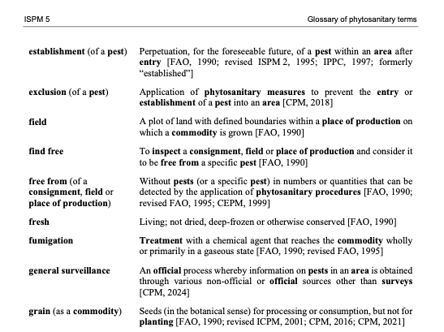
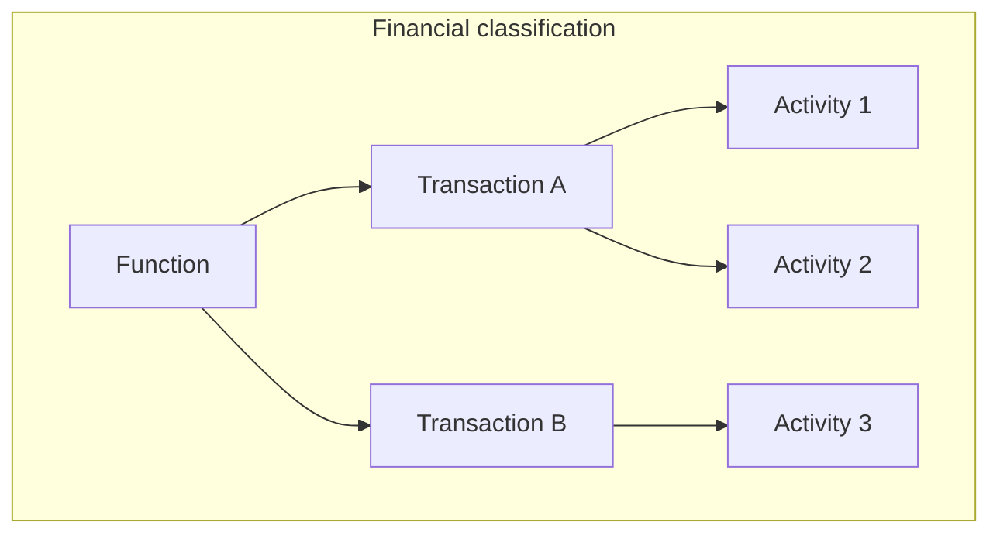
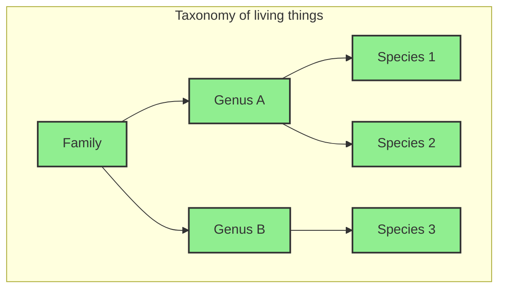
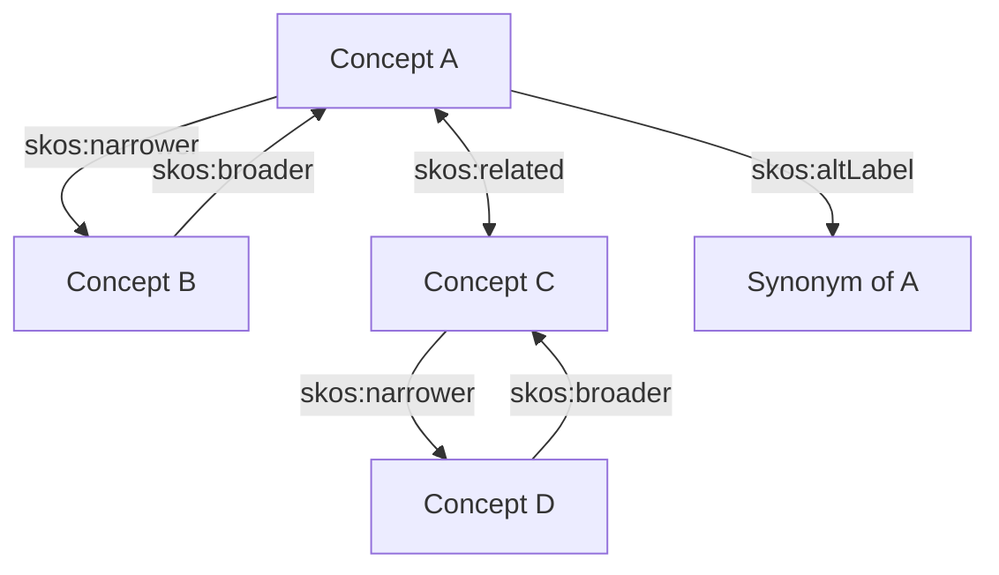
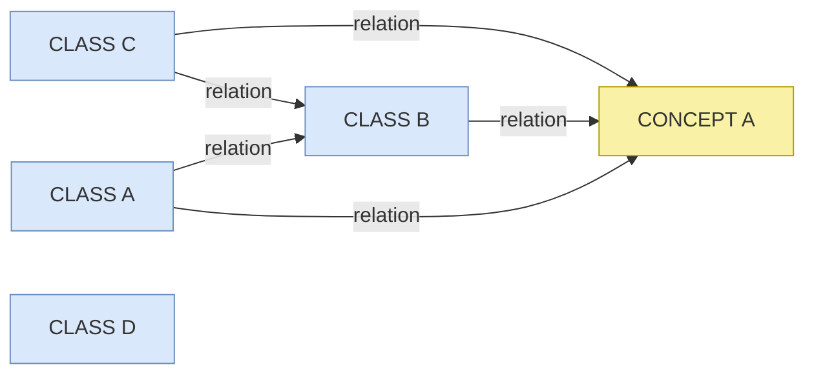
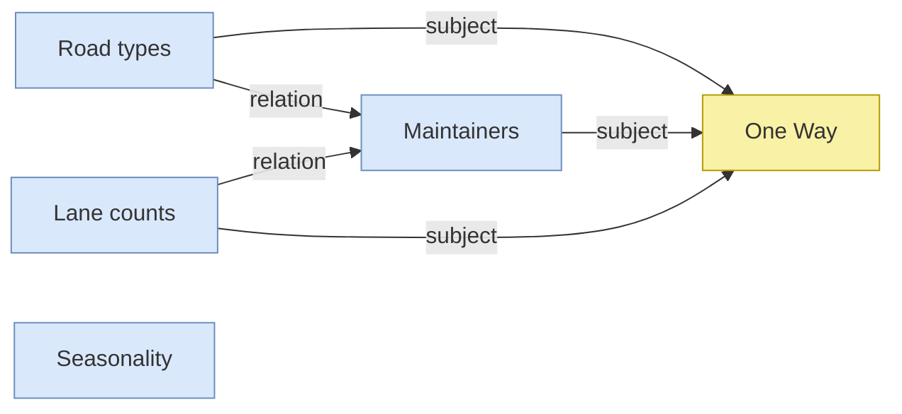
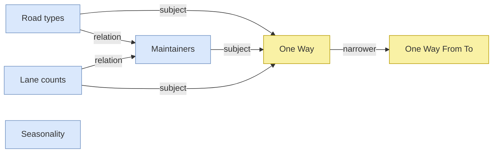
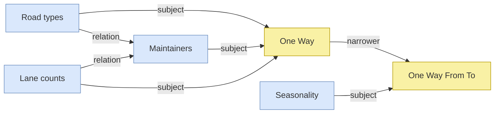
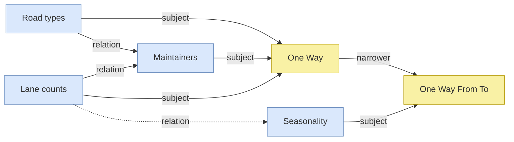

# Overview

This is the first in a series of modules that range from introductory guidance, tips for experienced vocabulary practitioners and lessons in using innovative vocabulary tooling. These modules needn't be approached in series order, but note the step-by-step exercise that continues through out other modules. In summary, the modules are:
>
> _Introduction to Vocabularies_ (this module)
> - Vocabulary types
> - Core properties
> - Excercise - start using VocEdit
>
> [Advanced Vocbulary Editing](https://docs.kurrawong.ai/concepts/vocabs/creation/)
> - Mapping between vocabularies
> - Additional properties
> - Exercise (continued from _Introduction_)
>
> [Vocabulary Reuse](https://docs.kurrawong.ai/concepts/vocabs/vocab-reuse/)
> - Reuse patterns
> - Importing concept from other vocabularies
> - Exercise (continued from _Advanced_)
>
> [Vocabulary systems](https://docs.kurrawong.ai/concepts/vocabs/vocab-systems/)
> - VocEdit + GitHub (with new exercise)
> - VocExcel
> - SHACL Validator
> - RDF Converter
>
> [Vocabulary patterns_](https://docs.kurrawong.ai/concepts/vocabs/patterns/)
> - Handling special cases and advanced tips

 

> 💡 _Identifies troubleshooting tips, common errors and potential issues._
> 🚧 _Exercises_
> 🎬 _Vidoes_

## Introduction to Vocabularies

As languages speakers, we have developed the categorization of "things" to both understand and communicate our experience of the world. The sheer volume of data that we interact with has necessitated a shared understanding of naming and definition. In large-scale data holdings, standardisation and disambiguation through vocabularies becomes a necessity.

When sharing information across diverse groups, catalogues or software applications, there is need for a common understanding of exactly what is being referred to. This is where controlled vocabularies provide terminology applied to information, driving agreed understanding of concepts. Vocabularies provide both textual labels and definitions for human understanding, and machine-readable unique identifier for machine processing.

Whatever size and shape, the vocabularies mentioned in these modules are designed for describing data and content. Vocabularies can be used to describe (or catalogue) content in information systems. Vocabularies can also optimise search engines and provide the basis for navigation in information systems, making it easier for users to find content and data.

## Vocabulary types

In this section we will introduce some common vocabulary types. By introducing simple and more complex vocabulary examples we will introduce some important vocabulary features.

### Glossary

... _defining terms_

Glossaries are a very common form of vocabulary found in many print and web resources. A glossary is a list of concepts, expressed by natural language terms (we will refer to _terms_ and _labels_ interchangeably) with added definitions.

  

Each concept in a Glossary has at least one label and one definition. Some glossaries include _see_ references that direct a user to a preferred term. This _equivalence_ mapping is a common feature in more complex vocabulary types such as a **thesaurus** (see below). But first we will look at vocabularies that include hierarchy relationships.

### Taxonomies

... _a very short history_

Taxonomies are vocabularies with hierarchical relationships between concepts. Conventionally, we might say that concept A is _broader_ than concept B, when the _all-some_ rule apples: All B's are A, and some A's are B. For example, _all apples are fruit, and some fruit are applies_. Therefore, _fruit_ is broader than _apples_.

Modern taxonomies that are used to organise and retrieve data owe their heritage largely to two disciplines: biology, or the taxonomy of living things, featuring familiar concepts of class, family, genus, species etc..., and financial classifications, where concepts are typically categorised as either function, activity of transaction.

The definition, or meaning of a given term is given, in part, by its relationship to broader and narrower terms. For example, we have a clearer understanding of what _crane_ means if it has a broader relationship with _birds_ (and not _construction equipment_).

 

We will see below in [Vocabularies in the context of knowledge graphs](#vocabularies-in-knowledge-graphs) how the broader / narrower relationship between concepts can improve search and extraction functions in data where vocabularies are used to enrich data.

 

### Thesaurus

... _a (more) complete picture_

The modern retrieval thesaurus combines the structure of a taxonomy with additional non-hierarchical relationships and also synonym control. Thesauri establish _hierarchy_, _association_ and _equivalence_ between terms. Each can be expressed using the Simple Knowledge Organization System (SKOS) properties `skos:broader` / `skos:narrower`; `skos:relation`; and `skos:prefLabel` / `skos:altLabel` ([W3C, 2009](#references-and-further-reading)).

> 💡 **Tip:** the ``skos:related`` property is most useful for relating disparate concepts in deep, complex hierarchies. Use ``skos:related`` sparingly - don't relate everything to everything! 

We will look at SKOS properties in more detail in the [Properties](#vocabulary-properties) section.

### Vocabularies in knowledge graphs

Thought of as an interconnected system of data classes, a knowledge graph may include vocabularies as additional classes that connect with some or all other classes. In a knowledge graph, a vocabulary concept can be modelled as just another class instance.

One function that vocabularies serve is to supplement and fill semantic gaps in data relations. In the example below, classes A, B an C are each related to each other in some way. Class D is not related to other classes. A concept from a vocabulary is also included, and has relationships to classes A, B and C.

The relationships between classes and concepts is often of a _subject_ nature - that is to say the class instance is _about_ the concept.

Now we will look at a domain example using possible interrelationships between spatial data classes, focusing on roads.

The concept ``One Way`` comes from ``Road directions`` vocabulary, where the concept ``One Way From To`` may be defined as a `skos:narrower` concept.

Let's assume that the ``Seasonality`` class contains data profiled with the ``One Way From To`` directional roads concepts. So there is also a relationship with the `skos:narrower` concept provided in the vocabulary. This hierarchy relationship in the vocabulary then provides a bridge between classes of information.

Because of this relation between concepts in the vocabulary, it's possible to make an _inference_ that connects classes that were previously unrelated, such as between ``Lane counts`` data and ``Seasonality`` data.

Let's put this into a narrative form:

_We know that some roads are closed on a seasonal basis, but we don't know what portion of these are one lane roads. But we do have data about the seasonality of 'One Way From Two' roads, also called 'One way with vector' roads. Because these roads are defined as a type of One Way road (via `skos:narrower`), we can infer information about seasonal road closures for one lane roads._

## Vocabulary properties

Vocabularies contain, as a minimum: _preferred labels_, _definitions_ and _identifiers_. We have already introduced concepts relations with other concepts. In this section we will look at more concept properties, including properties that are required for validation in vocabulary quality standards.

### Minimum properties: prefLabel, definition and identifier

To comply with VocPub profile ([AGLDWG, n.d.](#references-and-further-reading)), each concept must have at least:

- a `skos:prefLabel` which is the main way that we say and understand the concept;
- a `skos:definition` - a short note that describes the concept;
- an _Identifier_ - a unique way of distinguishing the concept from other concepts

#### 🚧 Exercise: 0pen, edit and save a vocabulary

These modules will include a number of editing exercises that use the VocEdit tool and the _Pest Risk Pathway_ vocabulary (PRP). The PRP is un-published and hosted by KurrawongAI for training purposes. In this exercise we will add a new concept; a concept preferred label; a concept definition; and a concept identifier.

💡 _Chrome browser is needed to use the VocEdit tool._

1. **Go to** [Download TTL](https://raw.githubusercontent.com/Kurrawong/demo-vocabs/main/vocabs/pestRiskPath_training.ttl)  
  *(Right-click and choose “Save link as...” to download)*
2. **Save** the file to your local directory  
3. **Open** Chrome (if not already)  
4. **Go to** [VocEdit](https://vocedit.kurrawong.ai)  
5. **Select** **Project** > **Open** > **Local file**
6. **Select** _pestRiskPath_training.ttl_ from your local directory  
7. **Select** **Resource** > **Create new**
8. **Resource type** > **Concept**
9. **Add** _http://example.com/pestRiskPath/_
10. **Open a new tab** and go to [UUID Generator](https://www.uuidgenerator.net)  
11. **Copy** the UUID  
12. **Paste** the UUID in the **IRI** field and after the stem _http://example.com/pestRiskPath/_. So the full IRI should look be: _http://example.com/pestRiskPath/[UUID]_
13. **Select Create** 
14. **Edit** > **prefLabel** > **"+"** > **Literal string with language**
15. **Add** _Wind dispersal_
16. In Lang box, **Add*** "en"
17. **definition** > **Add a literal with language**  
18. **Add** _Dispersal of pests by wind_
19. In Lang box, **Add*** "en"
23. **Concept scheme relationships - topConceptOf** > **Select** **"+"** > _IRI_
24. **Select a value** > select _pestRiskPath_
26. **Save**

The pestRiskPathway.ttl will now be updated in your local directory, with the new concept _Wind dispersal_ added.

## Broader / Narrower

We have already introduced the ``skos:broader`` and ``skos:narrower`` relationships in the sections on _taxonomies_ and _thesaurus_ vocabularies. 

Depending on the type and complexity of a vocabulary, there may be a requirement that all concepts are related to another concept via ``skos:broader`` property. In a taxonomy or thesaurus vocabulary project, a concept that does not have a `skos:broader` concept may be considered an _orphan_, unless it is a _top concept_, indicated with the `skos:topConceptOf` property. The SKOS standard does not require concepts to be arranged in a hierarchy. Some vocabularies will be mostly flat with only selected concepts in narrower relationships to broader concepts.

If a `skos:Concept` does not have a `skos:broader` property, the VocPub profile requires that it must reference the relevant `skos:ConceptScheme` IRI with the `skos:topConceptOf` property. 

**Tip:** Broader and narrower relationships are reciprocal - that is, if A is broader than B, then B is narrower than A. For example:

- Dynamic land cover `skos:broader` Land cover and land use
- Land cover and land use `skos:narrower` Dynamic land cover

- Apples `skos:broader` Pomme fruit
- Pomme fruit `skos:narrower` Apples

- Hospitals `skos:narrower` Private hospitals
- Private hospitals `skos:broader` Hospitals

Arranging concepts into a hierarchy supports discovery via:

- _Search expansion_ - a system can expand results by matching any narrower concepts of a search term, e.g. a search for _Granitoid_ returns resources about _granitoid_ OR _granite_
- _Navigation_ - top-down navigation or breadcrumb links can be launched in an interface using broader / narrower relationships. For example, clicking on _Pomme fruit_ launches a list of links to apples, pears and quinces

In a vocabulary, it's possible to keep adding narrower relationships by creating more and more specific concepts. For example, a catalogue that is about horticulture probably needs a vocabulary with more specific (narrower) concepts than just _apples_ (e.g. _Kiku Fuji_).

💡 Only add narrower concepts that you would expect to be used to describe content in a catalogue, and distinguish that content from others, with that concept. Don't make a vocabulary hierarchy very deep with specific concepts just because you can!

#### 🚧 Exercise: add broader concept relations

In this exercise we will add a `skos:broader` relationship between two concepts. Note that once a concept has a broader relationship, it is no longer indicated by `skos:topConceptOf` and and 'top concept' status is removed.

1. **Go to** [VocEdit](https://vocedit.kurrawong.ai) in Chrome  
2. **Project** > **Open** `pestRiskPath_training.ttl` from your local directory  
3. **Select** _Spore dispersal_ from the left-hand list of concepts  
4. **Concept relationships** > **Broader** > **Add a new value** > **IRI**
5. From the Select a value dropdown, search for or select _Host plants_ > **select**
6. **Save**

This change optimises the SKOS model by applying a broader relationship between concepts that are conceptually broader and narrower. In a retrieval system we might expect a query for resources about host plants as pest vectors to return a resource about _Spore dispersal_. The `skos:broader` relation support such an inference.

### Alternative labels

Each concept must have at least one _Preferred label_ (`skos:prefLabel`), based on the word or phrase that best describes the concept. We often use different terms to mean the same thing - the `skos:prefLabel` should be the term that is used most frequently, or understood and used by most expected users of a system or catalogue.

In addition, each concept may have one ore more _Alternate labels_ (``skos:altLabel``). It's a good idea to add one or more ``altLabel`` to a concept so that it can be found in different ways. A concept can have any number of alternate labels, provided they are similar enough to the common understanding of the concept.

💡 **Tip:** when adding a `skos:altLabel`, ask this question: _If I searched with a preferred label, and found some information matching an alternative label in the text, would I be satisfied by the search result?_

Here are some common scenarios where we might need to choose between preferred and alternative labels:

#### Common vs Scientific terms

Connect scientific or technical names with common names. For example:

- Red imported fire ant ``skos:altLabel`` Solenopsis invicta
- Boghead Coal ``skos:altLabel`` Torbanite
- Spore dispersal `skos:altLabel` Sporulation

#### Superseded terms

Even if a term is no longer used in recent content, users may still search a catalogue using superseded language. Storing superseded terms as alternative labels helps to group content that contains antiquated language with content written in current language. For example:

- Aeolian Sand ``skos:altLabel`` Eskimo Sand
- Utility hole ``skos:altLabel`` Manhole

#### Acronyms vs phrases

In general, an acronym or initialism should be managed as an ``skos:altLabel``; example: 

- Greenhouse gasses ``skos:altLabel`` GHG 

An exception is when the acronym is better known or more frequently used. For example:

- TNT ``skos:altLabel`` Trinitrotoluene
- CSIRO ``skos:altLabel`` Commonwealth Scientific and Industrial Research Organisation

#### Official vs common language

Use an ``altLabel`` to connect official or technical language with natural language. For example:

- Bi-directional ``skos:altLabel`` Two way
- Alcohol-impaired driving ``skos:altLabel`` Drink-driving

#### 🚧 Exercise: add alternative labels

In this exercise we will add an alternative label to a concept. 

💡 **Tip:** You will need to first add the `skos:altLabel` property to VocEdit as it is not required by [VocPub](https://linked.data.gov.au/def/vocpub).

1. **Go to** [VocEdit](https://vocedit.kurrawong.ai) in Chrome  
2. **Project** > **Open** `pestRiskPath_training.ttl` from your local directory  
3. **Select** _Spore dispersal_ from the left-hand list of concepts  
4. **Other Properties** > **Add property**  
5. **Add** _http://www.w3.org/2004/02/skos/core#altLabel_ > **Add property**  
6.  in the _altLabel_ field you just created > **"+"** > **Add new value** > **Literal with language**
7. **Add** _Sporulation_
8. **Add** "en" to _lang_ field
9. **Save**

###  Top Concepts

If a `skos:Concept` does not have a `skos:narrower` relationship, it is automatically assumed to be a `skos:topConceptOf` a `skos:ConceptScheme` and must be declared as such.

A concept may be moved out of the 

## Concept Scheme

A Concept Scheme is some metadata about the vocabulary as a whole - the vocabulary title (`skos:prefLabel`), a definition (`skos:definition`), and a unique identifier are minimum requirements. All vocabularies must have a Concept Scheme, and it should include:

- an Identifier - create an IRI following the same pattern as the IRIs for concepts. For the suffix, instead of a concept ID, add a Concept scheme ID. This may be the name of the Concept scheme (the vocabulary), e.g.: - ``https://linked.data.gov.au/def/road-types``
  ... _where Road types_ is the name of the concept scheme.

- a [Preferred label](http://www.w3.org/2004/02/skos/core#prefLabel) - the same property that is used for a Concept. Use a Preferred label for the name or title of the vocabulary (this may also be used for the Concept Scheme ID)
- a [Definition](http://www.w3.org/2004/02/skos/core#definition) - a definition of the Concept Scheme. Use plain text only but paragraphs may be separated by newlines. Also used for Concepts
- a [Created](http://purl.org/dc/terms/created) date. When the Concept Scheme was first created. This might be automatically created by a vocabulary editor
- a [History](http://www.w3.org/2004/02/skos/core#historyNote) note - a note on the origin or history of a vocabulary - such as how or from what it was generated.

#### 🚧 Exercise: edit a concept scheme

We will continue to edit the Pest Risk Pathway vocabulary, but this time we will edit the concept scheme which is the metadata about the vocabulary as a whole.

1. **Go to** [VocEdit](https://vocedit.kurrawong.ai) in Chrome    
2. **Project** > **Open** `pestRiskPath.ttl` from your local directory  
3. **Select** **Pest Risk Pathway** from under **Vocabularies** in the left-hand panel  
4. **Annotations** > **definition** > **"+"** > **Add a new value** > **literal with language**  
5. **Add** _A vocabulary describing various structures, modes and activities that introduce unwanted pests, weeds and diseases._
6. **Add** "en" to _lang_ field
7. **Save**

## Summary

In this module we have introduced vocabularies - different types and how they are useful. We have also used a vocabulary editing tool to create the minimum elements for a concept and a concept scheme. 

## References and Further Reading

* AGLDWG. (n.d.). VocPub profile specification. Retrieved April 17, 2025, from <https://linked.data.gov.au/def/vocpub>
* W3C (n.d.). QSKOS. Retrieved March 5, 2025, from <https://www.w3.org/2001/sw/wiki/QSKOS>
* W3C (2009). SKOS reference. <https://www.w3.org/TR/skos-reference/>
* W3C (2014). Turtle: Terse RDF triple language (W3C Recommendation). Retrieved from <https://www.w3.org/TR/turtle/>
