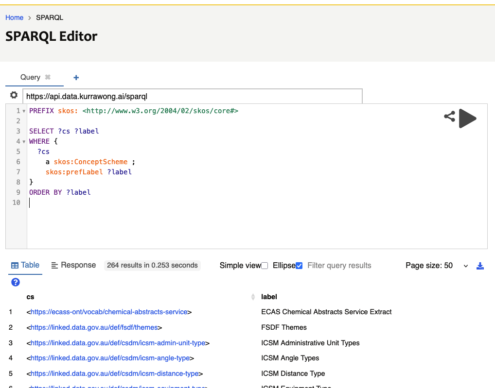
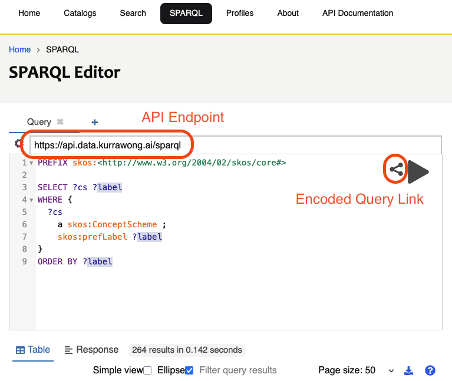
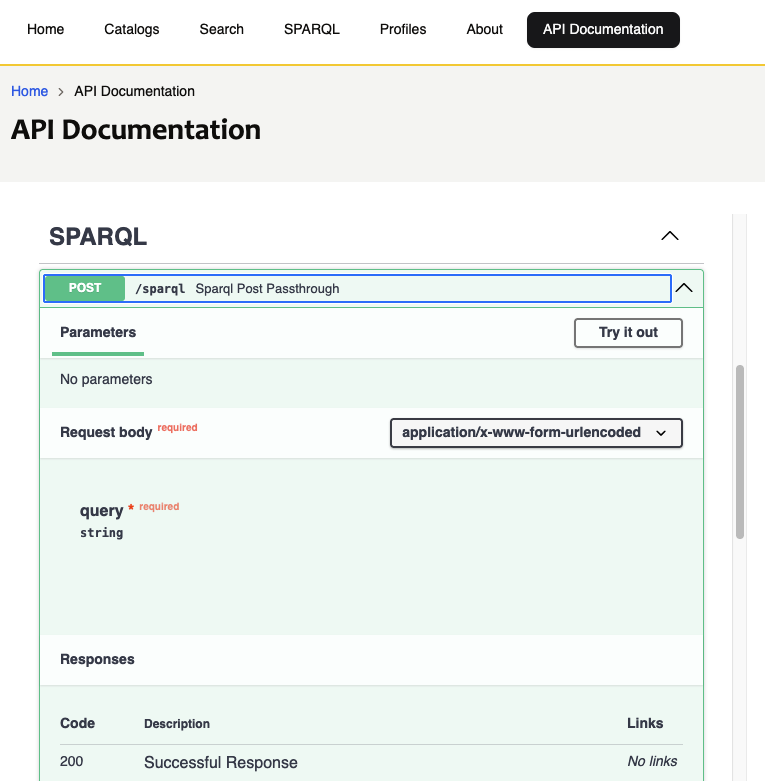

# Querying

> ***Scope***
>
> Querying vocabularies stored in RDF using the SPARQL query language

>
> ***Audience***
>
> Technical vocabulary users: programmers and analysts tasked with providing sophisticated extracts from vocabularies.
>
> ***Outcome***
>
> Technical vocabulary users should get a feel for how to query vocabularies using SPARQL and have a list of some of the common queries to draw on.
>
> ---

## SPARQL querying

Vocabularies using RDF as the data structure can be queried with [SPARQL](https://www.w3.org/TR/sparql12-query/) which is an SQL-like query language.

SPARQL can access any part of RDF data so it can be used to filter, join, reorder and convert vocabularies - everything.

### SPARQL introduction

If you are unfamiliar with SPARQL, why not work through some of our SPARQL training:

* <https://github.com/Kurrawong/sparql-training-live>

That training is a series of 4 modules that will take you right through all aspects of SPARQL.

It is also available for delivery as a paid course, see <https://kurrawong.ai/services/training>.

Example queries for SKOS vocabularies are given below.

## How to query

If you are familiar enough with SPARQL to want to start querying vocabularies, you can apply the queries below, or write your own, and apply them to vocabularies in two main ways:

1. [Query a system](#query-a-system)
2. [Query files](#query-files)

### Query a system

### Use a UI

If your vocabularies are delivered online via system like [Prez](https://prez.dev/), it will have a "SPARQL Endpoint" User Interface which will allow you to lodge queries against the content.

Here is the KurrawongAI demo Prez instance's SPARQL Endpoint:

* <https://data.kurrawong.ai/sparql>

Try running this query to list all vocabularies:

```sparql
PREFIX skos:<http://www.w3.org/2004/02/skos/core#>

SELECT ?cs ?label 
WHERE {
  ?cs 
  	a skos:ConceptScheme ;
	skos:prefLabel ?label 
}
ORDER BY ?label
```

You should see quite a few vocabularies (250+) that we've worked on listed, something like this:



Another option is to load all your vocabulary files into an RDF database system such as [GraphDB](https://graphwise.ai/components/graphdb/) or, if using cloud computing, [AWS' Neptune](https://aws.amazon.com/neptune/). These all offer SPARQL endpoints. 

### Use an API

Most systems that provide a SPARQL Endpoint also make that endpoint available as an Application Programming Interface for automated use.

For the system at <https://data.kurrawong.ai/sparql>, the API endpoint is indicated per-query:



With the query above loaded, as per the image above, the Encoded Query Link will give you options to call that query directly as a URL or as a [cURL](https://curl.se/) command, both with the query URL-encoded:

```bash
curl https://api.data.kurrawong.ai/sparql --data query=PREFIX%20skos%3A%3Chttp%3A%2F%2Fwww.w3.org%2F2004%2F02%2Fskos%2Fcore%23%3E%0A%0ASELECT%20%3Fcs%20%3Flabel%20%0AWHERE%20%7B%0A%20%20%3Fcs%20%0A%20%20%09a%20skos%3AConceptScheme%20%3B%0A%09skos%3AprefLabel%20%3Flabel%20%0A%7D%0AORDER%20BY%20%3Flabel -X POST
```

Prez systems, and many others featuring SPARQL endpoints, also indicate their API endpoints using OpenAPI methods:



### Query files

To query a collection of files containing vocabularies, you will need to either put the file content in a query system, such as [our online SPARQL query facility](https://tools.kurrawong.ai/query), or use a desktop tool that allows queries to be run against files.

Our [kurra Python package](https://github.com/Kurrawong/kurra) can be used as a command line application that allows queries in files to be posed to RDF data in files:

```
kurra sparql DATA_FILE.ttl QUERY_FILE.sparql
```

## Common vocab queries

Some common SPARQL queries for SKOS vocabularies are:

### List all Concepts

This query lists all the Concepts in the Concept Scheme (vocabulary) "FSDF Themes", identified by the IRI `<https://linked.data.gov.au/def/fsdf/themes>` by the relation `skos:inScheme` and selects their IRI and label.

```sparql
PREFIX skos: <http://www.w3.org/2004/02/skos/core#>

SELECT ?c ?label 
WHERE {
    ?c 
        a skos:Concept ;
        skos:prefLabel ?label ;
        skos:inScheme <https://linked.data.gov.au/def/fsdf/themes> ;
    .
}
ORDER BY ?label
```

If you leave out the line `skos:inScheme <https://linked.data.gov.au/def/fsdf/themes> ;`, you will get all the concepts stored in a system, from all vocabularies, which may or may not be helpful.

### Filter Concepts

Get all the concepts containing 'Parcel' in their preferred label:

```sparql
PREFIX skos: <http://www.w3.org/2004/02/skos/core#>

SELECT ?c ?label 
WHERE {
    ?c 
        a skos:Concept ;
        skos:prefLabel ?label ;
        skos:inScheme <https://linked.data.gov.au/def/fsdf/themes> ;
    .
  
    FILTER (CONTAINS(?label, "Parcel"))
}
ORDER BY ?label
```

When run at <https://data.kurrawong.ai/sparql>, this query should return two results: "Land Parcel Boundaries" and "Land Parcel and Property".

### List Top Concepts

Top Concepts are the top elements in a vocabulary's Concept Hierarchy. All vocabs worked on by KurrawongAI list Top Concepts directly from the vocabulary:

```sparql
PREFIX skos: <http://www.w3.org/2004/02/skos/core#>

SELECT ?c ?label 
WHERE {
    ?cs skos:hasTopConcept ?c .
  
    ?c 
        a skos:Concept ;
        skos:prefLabel ?label ;
        skos:inScheme <https://linked.data.gov.au/def/fsdf/themes> ;
    .
}
ORDER BY ?label
```

When run at <https://data.kurrawong.ai/sparql>, this query should return just one result: "Spatial".

!!! note

    Not all SKOS vocabularies indicate Top Concepts directly as a property of the vocabulary (`?cs skos:hasTopConcept ?c`). 
    Some indicate it per-Concept (`?c skos:topConceptOf ?cs`). If this is the case - perhaps the query above returns no values -
    then use this variant:

    ```sparql
    PREFIX skos: <http://www.w3.org/2004/02/skos/core#>

    SELECT ?c ?label 
    WHERE {
        ?cs skos:hasTopConcept ?c .
      
        ?c 
            a skos:Concept ;
            skos:prefLabel ?label ;
            skos:inScheme <https://linked.data.gov.au/def/fsdf/themes> ;
            skos:topConceptOf ?cs ;
        .
    }
    ORDER BY ?label
    ```

    This will also vield the same results as above when run at <https://data.kurrawong.ai/sparql>.

### List Children Concepts

There are two possible ways concepts may be indicated as being children of a particular concept:

1. children are _narrower_ than the parent
2. the parent is _broader_ than the children

Different vocabularies prefer one or the other approach and some vocabulary systems implement both. The following query will check both:

```sparql
PREFIX skos: <http://www.w3.org/2004/02/skos/core#>

SELECT DISTINCT ?c ?label 
WHERE {
	BIND (<https://linked.data.gov.au/def/fsdf/themes> AS ?vocab)
	BIND (<https://linked.data.gov.au/def/fsdf/themes/spatial> AS ?parent)

  	{ ?parent  skos:narrower ?c }
    UNION
    { ?c skos:broader ?parent }
    
    ?c 
        a skos:Concept ;
        skos:prefLabel ?label ;
        skos:inScheme ?vocab ;        
    .
}
ORDER BY ?label
```

Just replace the values for the Vocab and the parent Concept as needed.

### Concepts within Collections

Sometimes vocabularies rgroup Concepts within Collections. To do this, the Collection indicates Concepts via the `skos:member` predicate:

```sparql
PREFIX skos: <http://www.w3.org/2004/02/skos/core#>

SELECT ?c ?label
WHERE {
    <http://resource.geosciml.org/classifier/cgi/waste-storage>
        skos:member ?c .
  
    ?c 
        a skos:Concept ;
        skos:prefLabel ?label ;
        skos:inScheme ?vocab ;        
    .  
}
ORDER BY ?label
```

### Get the top 2 levels of a vocab

Some vocabs have "levels" that mean something, that is Concepts in a hierarchy where the hierarchy distance, counting from the top, is significant. Some other vocabs are large, and sometimes we only want the top parts. 

To retrieve Concepts in the top 2 levels of a vocab, but not those in levels 3+:

```sparql
PREFIX skos: <http://www.w3.org/2004/02/skos/core#>

SELECT DISTINCT ?c ?label
WHERE {
    BIND (<http://resource.geosciml.org/classifierscheme/cgi/2023.11/mineral-deposit-model> AS ?vocab)

    { ?c skos:topConceptOf ?vocab }  
    UNION
    { ?c skos:broader/skos:topConceptOf ?vocab } 

    ?c 
      a skos:Concept ;
         skos:prefLabel ?label ;
         skos:inScheme ?vocab ;   
    .
}
ORDER BY ?label
```

This query asks for all Concepts that are Top Concepts of the vocabulary and all those that have those Top Concepts as direct parents. If we wanted 3 levels, we could do this:

```sparql
PREFIX skos: <http://www.w3.org/2004/02/skos/core#>

SELECT DISTINCT ?c ?label
WHERE {
    BIND (<http://resource.geosciml.org/classifierscheme/cgi/2023.11/mineral-deposit-model> AS ?vocab)

    { ?c skos:topConceptOf ?vocab }  
    UNION
    { ?c skos:broader/skos:topConceptOf ?vocab } 
      UNION
    { ?c skos:broader/skos:broader/skos:topConceptOf ?vocab } 

    ?c 
      a skos:Concept ;
         skos:prefLabel ?label ;
         skos:inScheme ?vocab ;   
    .
}
ORDER BY ?label
```

This just adds in an ask for those Concepts that have the Top Concepts as grandparents.

There is a method to search for Concepts at a given hierarchy level too, but it's tricky! Just [Contact Us](https://kurrawong.ai/contact) if you really need to do this!

### Get concepts that have null values

Some Concepts don't have values for all possible properties, for example `skos:altLabel`. To get all those Concepts that do as well as those that don't we use an `OPTIONAL` clause:

```sparql
PREFIX skos: <http://www.w3.org/2004/02/skos/core#>

SELECT *
WHERE {
    ?c 
        a skos:Concept ;
        skos:prefLabel ?label ;
        skos:inScheme <https://data.idnau.org/pid/glossary> ;
    .
  
    OPTIONAL {
      ?c skos:altLabel ?alt_label .
    }
}
ORDER BY ?label
```

If run at <https://data.kurrawong.ai/sparql>, the above query will return 34 Concepts, some of which have alt labels, some of which don't.

### List all vocabularies

If you have a system that stores multiple vocabularies, characterised as SKOS Concept Schemes, this query will list them all:

```sparql
PREFIX skos: <http://www.w3.org/2004/02/skos/core#>

SELECT ?c ?label 
WHERE {
    ?c 
        a skos:ConceptScheme ;
        skos:prefLabel ?label ;
    .
}
ORDER BY ?label
```

Try this on the KurrawongAI Prez server: <https://data.kurrawong.ai/sparql>

