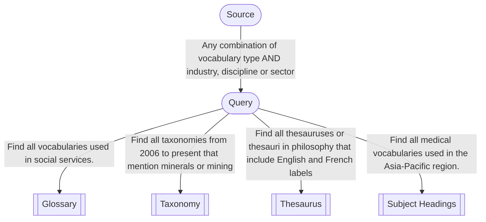

# Vocabulary Reuse


>
>***Scope***
>
>This content is intended to provide guidance on the effective reuse of vocabularies. It will explain the benefits of reuse; how to locate suitable existing vocabularies; how to make attributions and manage provenance in reused vocabularies and vocabulary segments. 

>
>***Audience***
>
>_This module is primarily targeted to managers and owners of established vocabularies. It is assumed that learners have some experience with using document management or version control systems, and general familiarity with data management in practice._
>
>***Outcome***
>
>_Learners should be able to adopt vocabularies in part or in whole into their local contexts, and understand implications for managing externally sourced vocabularies as part of local operations_
>
>----------------

> 💡 _Identifies troubleshooting tips, common errors and potential issues._

> 📝 _Notes that summarise content at the end of a module._

> 🚧 _Exercises_


## An Introduction to vocabulary reuse

Whatever domain we work in, there's a fair chance that useful vocabularies have already been developed by third parties. And as for any data management operation, it's a good idea to seek opportunities to reuse existing vocabularies. In this module we'll cover:
- Weighing up the effort: reuse vs build from scratch.
- Finding existing vocabularies that meet your scenario
- Evaluating the suitability, and reuseability of existing vocabularies
- Matching vs importing external Concepts
- Adopting parts vs whole vocabularies
- Attribution and provenance: representing and preserving primary sources.

## Reuse patterns

Is it worth reusing existing vocabularies in part or whole? There are various patterns that can be followed:

- **Build from scratch** - just make a vocabulary based on familiar resources
- **Adoption** - Importing concepts from some or perhaps most of your vocabulary comprises concepts sourced from existing vocabularies, faithfully retaining and presenting definitions and other metadata from the source;
- **Verbatim** - access and reuse a vocabulary as is
- **Customise** Verbatim, with minor changes, such as to labels


### Build from scratch 
Why not develop a vocabulary from scratch, with sources of warrant that you know are relevant to your community and use case?

Even if you build from scratch, you might consider developing a vocabulary that is itself reuse-able in your industry, sector or in other regions. The more use your vocabulary gets, the more interoperability you have with other systems and catalogues. If you want your vocabulary reused, ensure:

- clear rights and licensing are declared, within the vocabulary concept scheme and in surrounding web context
- governance arrangements for the vocabulary are stated somewhere - build trust by declaring the update history and cycle, and commitments to persisting Concept IRIs
- distributions: ensure your vocabulary can be accessed in standard formats and over standard APIs

> 💡 see _VocPub Specification_, sections 2.1.13 / 2.1.14, about declaring [licenses and rights](https://agldwg.github.io/vocpub-profile/specification.html#vocabulary).

Even if you build from scratch, you can match home-grown concepts with concepts in external vocabularies - see [Mapping concepts with other vocabularies](#mapping-concepts-with-other-vocabularies).

### Adoption
You might import a cluster of concepts from an existing vocabulary into a local vocabulary project. There are a number of things you should do to indicate provenance of such concepts, and to support ongoing management of imported concepts, including:

- adding a `prov:wasDerivedFrom` statement for an imported Concept
- adding a `rdfs:isDefinedBy` statement indicating an IRI of a Concept scheme where the Concept is from
- creating a `skos:Collection`, specifically for grouping concepts derived from some other vocabulary

See [Import a concept](#-import-a-concept) for details.

### Verbatim

While using an existing vocabulary as-is requires no editing work, there will usually be a need to attribute the creator or publisher within your local business context. Also ensure rights information is checked, even if you have no plans to extend or remix the vocabulary - look out for these properties:

```turtle
PREFIX dcterms: <http://purl.org/dc/terms/>
PREFIX isorole: <https://standards.iso.org/iso/19115/-3/cit/1.0/>
PREFIX sdo: <https://schema.org/>

# sdo:license
# dcterms:license - equivalent to sdo:license;
# dcterms:accessRights - not really 'rights' as such, but if access rights restricted in some way, look further into what you allowed to do with the vocabulary;
# dcterms:rights
# sdo:copyrightHolder
# isorole:rightsHolder - equivalent to sdo:rightsholder
```

### Customise

You may make minor changes to published vocabularies to meet local requirements. Vocabulary concepts may be added; labels may be updated (changes to spelling or swapping an `skos:altLabel` for `skos:prefLabel`). Changes will need to be acknowledged at both the Concept and concept scheme level - see [Add an imported concept](#add-an-imported-concept) for how to do this. 

## Finding vocabularies

If you are going to **Adopt**, use **Verbatim** or **Customise** a vocabulary, you'll need to find relevant vocabularies to do so with. Even if you **Build from scratch**, it's a good idea to know about other vocabulary work already done in your domain. There may already be vocabularies that meet your requirements, such as enriching the semantics of a metadata catalogue. They may exist in a nearby knowledge domain, industry or sector, and may originate in other global regions.

Look for vocabularies available for reuse listed in vocabulary registries and discovery services, such as:

- [Research Vocabularies Australia](https://vocabs.ardc.edu.au): vocabularies span a wide range of research and industry domains. Vocabulary search can be filtered by format and licensing, and many may be accessed directly from the RVA site via download or API.
- [BARTOC.org](https://bartoc.org): this is an international registry of vocabularies and ontologies in many languages and with over 2,500 records. 
- [Linked Open Vocabularies](https://lov.linkeddata.es/dataset/lov/): a community-curated catalog of RDF vocabularies used in Linked Data communities. LOV provides metadata, usage statistics, and interlinking information for vocabularies.
- [ID.LOC.GOV - Linked Data Service](https://id.loc.gov): the Library of Congress vocabularies widely used, especially for describing bibliographic data.

If you are searching the web for useful vocabularies, consider broadening your keyword search to include _taxonomy_; _classification_; _thesaurus_; _ontology_. 

## Reuse non-semantic vocabularies

Building a vocabulary from scratch is an easy win for ensuring vocabularies are well-formed and presented. Existing vocabularies published in other contexts may not be so well-formed! Existing vocabularies, including those found via vocabulary registries, will vary in their conformance with data standards such as RDF and SKOS, before even considering quality standards like VocPub and qSKOS [(W3C, n.d)](#references-and-further-reading). Here are a couple of challenges to consider:

### Unstructured 
An existing vocabulary is well presented but not machine-readable, such as in PDF or HTML. The vocabulary terms may indicate properties and relationships, but these properties themselves are not machine-readable. The vocabulary may need to be scraped and cleaned, eventually transformed into an RDF format compatible with a SKOS editing tool - if you haven't looked at open source solution yet, we [introduce VocEdit here](https://docs.kurrawong.ai/concepts/vocabs/introduction/#minimum-properties-preflabel-definition-and-identifier).

### Token IDs
An existing vocabulary has non-semantic or token identifiers, such as "123" or "AC123", that are not unique out of context and do not resolve on the web.

For provenance and tracking, use such identifiers as the suffix of IRIs in your vocabulary, such as
- `https://vocabs.mydomain.org/AC123`

Optionally, retain the identifier as a `skos:notation`:

- `skos:notation "AC123"`

You will still need to construct a full IRI - see tips below under [Unidentified](#unidentified)

### Unidentified
Where a vocabulary has labels but no identifiers - new IRIs will need to be constructed.

> 💡 Do NOT base IRIs on another organisation's domain without first consulting with them! Either use the Example namespace `http://example.com[vocab/ID]`, or use a domain that you own or control.

Where an existing vocabulary does not have any identifiers for concepts, you should mint your own, but make them opaque. Use a scheme like UUID - these can be generated using a [web service](https://www.uuidgenerator.net).

## Language

It is perhaps unnecessary to mention that a vocabulary fit for reuse needs to be comprehensible in the language of expected users. Optionally, a `skos:ConceptScheme` may indicate language codes used throughout a vocabulary `skos:Concept` labels, so that all labels do not need to be checked to identify multi-lingual patterns.

```turtle
:myScheme a skos:ConceptScheme ;
    dcterms:language <http://id.loc.gov/vocabulary/iso639-1/en> ;
    dcterms:language <http://id.loc.gov/vocabulary/iso639-1/fr> .
```

If an existing vocabulary includes language labels that are not needed in a local context, consider whether this impacts your system requirements. This is a consideration for the  [Adoption](#adoption) or [Customisation](#customise) scenarios - whether or not to keep labels in languages that will not be used, or to retain them but configure your system to suppress them in search indexes or user interfaces. 

### Regional language variations

Even within a natural language, there may be _regional_ differences, such as Australian use of _Socioeconomic status_ and United States use of _Social status_:

```turtle
@prefix fast: <http://id.worldcat.org/fast/> .
@prefix policy: <https://linked.data.gov.au/def/policy/> .
@prefix skos: <http://www.w3.org/2004/02/skos/core#> .

fast:1123359 a skos:Concept ;
	skos:prefLabel "Social status"@en ;
	skos:exactMatch policy:7353843a-9107-49af-bcd0-a8eac00bcd54
.

policy:7353843a-9107-49af-bcd0-a8eac00bcd54 a skos:Concept ;
	skos:prefLabel "Socioeconomic status"@en ;
	skos:exactMatch fast:1123359
.
```
When adopting a Concept and customising labels with the local context, consider retaining the regional variant as a `skos:altLabel`:

```turtle
@prefix policy: <https://linked.data.gov.au/def/policy/> .
@prefix skos: <http://www.w3.org/2004/02/skos/core#> .

policy:7353843a-9107-49af-bcd0-a8eac00bcd54 a skos:Concept ;
	skos:prefLabel "Socioeconomic status"@en ;
    skos:altLabel "Social status"@en ;  # retaining the FAST preferred label as an alternative label
	skos:exactMatch fast:1123359
.
```

Regional language variations can be declared in label language tags explicitly. 

```turtle
PREFIX : <http://vocabulary.curriculum.edu.au/scot/>
PREFIX dcterms: <http://purl.org/dc/terms/>
PREFIX skos: <http://www.w3.org/2004/02/skos/core#>

:2981 a skos:Concept ;
    skos:inScheme :6f1bbd29-fccf-4b0a-91d5-9089f768e88c ;
    skos:prefLabel
        "Forest fires"@en,
        "Bushfires"@en-AU,
        "Wildfires"@en-GB,
        "Bushfires"@en-NZ,
        "Forest fires"@en-US ;
    skos:altLabel 
	    "Bushfires"@en,
        "Firestorms"@en,
        "Wildfires"@en,
        "Firestorms"@en-AU,
        "Wildfires"@en-AU,
        "Vegetation fires"@en-GB
.
```
> 💡This example Concept has a combination of ISO 639-1 language tags (e.g. "@en") and BCP 47 (e.g. "@en-AU"). It's valid SKOS and RDF! But a downstream system may be expecting the locale-free ISO 639-1 scheme, so we recommend including at least one `skos:prefLabel` encoded as ISO 639-1.

> 💡 Multiple `skos:prefLabel` instances per `skos:Concept` with different language tags is _not compliant_ with VocPub Specification (AGLDWG, n.d.), but valid in SKOS.

## Mapping concepts with other vocabularies

In the basic structure of a vocabulary, concepts may be related to other concepts via broader, narrower or related properties. Sometimes a Concept needs to be related to a Concept in a _different_ vocabulary. Concept matching across vocabularies is done in a similar way but with different properties: [Broad match](http://www.w3.org/2004/02/skos/core#broadMatch), [Narrower match](http://www.w3.org/2004/02/skos/core#narrowMatch), [Related match](http://www.w3.org/2004/02/skos/core#relatedMatch).

Broad match example:

_Limestone packstone_ `skos:broadMatch` _Packstone_
... where _Limestone packstone_ is a Concept in the [GSWA rock classification scheme](https://linked.data.gov.au/def/gswa-rock-classification-scheme), and _Packstone_ is a Concept in the [INSPIRE code list register](http://inspire.ec.europa.eu/codelist).

Exact match example:

Child support `skos:exactMatch` Child support
... where _Child support_ is a Concept in both [Public Policy Taxonomy](https://linked.data.gov.au/def/policy/0acd51d0-a4a3-48eb-b6f4-aa086f966057) and [FAST](http://id.worldcat.org/fast/854679).


## Add an imported Concept

When a vocabulary imports concepts from another vocabulary, you will need to both add the Concept and also update the concept scheme. Optionally, you might create a 'collection' that groups the imported concepts in to a manageable frame. See [Import a concept](#-import-a-concept) for detailed steps for importing a Concept into a vocabulary.

## Additional elements
You can add more metadata to your Concepts and Concept schemes that will improve the clarity, scope and provenance of your vocabulary. Consider the following additional elements:

### Derived from

Use `prov:wasDerivedFrom` to indicate an IRI of an external vocabulary from which the vocabulary is derived. 

> 💡 An external vocabulary may not have an IRI - see VocPub Specification [section 2.1.7](https://agldwg.github.io/vocpub-profile/specification.html#vocabulary) for more information about indicating external vocabularies. 

### Derivation mode

A Derivation mode value is mandatory if a value is given for the `prov:wasDerivedFrom` property. Derivation mode concepts are selected from the [Vocabulary Derivation Modes](https://linked.data.gov.au/def/vocdermods) vocabulary.

### Notation

All concepts must have an IRI, and the IRI may be a completely opaque string based on a randomly generated string (such as from the UUID scheme). However, concepts may optionally store a `skos:notation`, which is like a secondary identifier and is based on some source or reference data that the Concept was derived from. Note that keeping notations when importing from vocabularies with [token IDs](#token-ids) is recommended.

### Defining vocabulary IRI

A Concept may be 'imported' from another vocabulary. We can assume that a Concept is imported if it shares the same or very similar metadata (such as a `skos:definition`) and labels. Such concepts should indicate the vocabulary from where they were imported with `rdfs:isDefinedBy` . Read more about [importing](#adoption) concepts and references. 

### Citation

For each Concept, a [Citation](https://schema.org/citation), an optional reference to or textual description of some source information, may be given.

Example:

```turtle
   PREFIX policytypes: <https://data.idnau.org/pid/vocab/policy-types/>
   PREFIX sdo: <https://schema.org/>
   PREFIX skos: <http://www.w3.org/2004/02/skos/core#>
   PREFIX xsd: <http://www.w3.org/2001/XMLSchema#>

    policytypes:policy a skos:Concept ;
    skos:prefLabel "policy"@en ;
    skos:definition "A strategic directive and high-level description of desired behaviour developed by an organisation to help govern how it functions..."@en ;
    sdo:citation "https://policy.usq.edu.au/documents/14266PL"^^xsd:anyURI
	.
```

... where the Citation indicates a policy definition originating from an external source. In this example the URL of the source is given so that it can be easily looked up and, if needed, verified and validated.

### 🚧 Import a Concept

To import a Concept from another vocabulary:

- add the new `skos:Concept`
- update the `skos:ConceptScheme`, and
- add a `skos:Collection` (optional)

1. Navigate in your browser to the vocabulary URI:  
   `https://linked.data.gov.au/def/road-travel-direction`

2. Download the Turtle (`.ttl`) representation directly using this link:  
   <a href="https://linked.data.gov.au/def/road-travel-direction.ttl" download>
   Download Road Travel Direction (Turtle file)
   </a>

3. Open the downloaded `.ttl` file in a text or code editor.

4. Add the prefix declarations:  
   ```turtle
   PREFIX : <https://linked.data.gov.au/def/road-travel-direction/>
   PREFIX cs: <https://linked.data.gov.au/def/road-travel-direction>
   PREFIX agldwgstatus: <linked.data.gov.au/def/reg-status/>
   PREFIX dcat:	<http://www.w3.org/ns/dcat#>	
   PREFIX dcterms: <http://purl.org/dc/terms/>
   PREFIX icsm: <https://linked.data.gov.au/org/icsm>
   PREFIX owl: <http://www.w3.org/2002/07/owl#>
   PREFIX prov: <http://www.w3.org/ns/prov#>
   PREFIX qsi: <https://linked.data.gov.au/org/qsi>
   PREFIX rdfs: <http://www.w3.org/2000/01/rdf-schema#>
   PREFIX reg:  <http://purl.org/linked-data/registry#>
   PREFIX sdo: <https://schema.org/>
   PREFIX skos: <http://www.w3.org/2004/02/skos/core#>
   # add prefix srti:
   PREFIX srti: <http://cef.uv.es/lodroadtran18/def/transporte/dtx_srti#>
   PREFIX xsd: <http://www.w3.org/2001/XMLSchema#>
   ```

5. Add the Concept in your vocabulary:

   ```turtle
   srti:clockwise a skos:Concept ;
       skos:prefLabel "Both directions"@en ;
   # add definition verbatim from source
       skos:definition "Clockwise."@en ;
       prov:wasDerivedFrom srti:#clockwise .
   ```

6. Add the Concept to the `skos:ConceptScheme`

```turtle
  cs:
    a skos:ConceptScheme ;
    sdo:keywords "transport"@en ;
    dcterms:created "2023-05-30"^^xsd:date ;
    dcterms:creator qsi: ;
    dcterms:identifier "road-travel-direction"^^xsd:token ;
# Date modified should be incremented:
    dcterms:modified "XXXX-XX-XX"^^xsd:date ;
    dcterms:publisher icsm: ;
    reg:status agldwgstatus:experimental ;
# Version information may be incremented
    owl:versionIRI :1.0 ;
    owl:versionInfo "1.0" ;
    skos:definition "This vocabulary describes the travel direction assigned to a section of a road. "@en ;
    skos:hasTopConcept
        :bi-directional ,
# Add new Concept "clockwise":
        srti:clockwise ,
        :none ,
        :one-way ,
        :one-way-against-vector ,
        :one-way-with-vector ,
        :unknown ;
# History note extended
    skos:historyNote "This vocabulary was created by the Queensland Spatial Information services and imports some concepts from other vocabularies" ;
    skos:prefLabel "Road Travel Direction"@en
.
```

7. Create new `skos:Collection`

💡 A `skos:Collection` references a `skos:Concept` using the `skos:member` property.

```turtle
:srti-vocabulary
    a skos:Collection ;
    dcterms:creator :qsi ;
    dcterms:publisher :qsi ;
    prov:wasDerivedFrom :srti ;
    rdfs:isDefinedBy cs: ;
    skos:definition "Concepts from the LOD SRTI DATEX II ontology" ;
    skos:inScheme cs: ;
    skos:member
        :clockwise ;
    skos:prefLabel "LOD SRTI DATEX II concept collection"@en ;
.
```
Save your changes.

## References and Further Reading

* AGLDWG. (n.d.). VocPub profile specification. https://linked.data.gov.au/def/vocpub/spec
* W3C (n.d.). QSKOS. https://www.w3.org/2001/sw/wiki/QSKOS
* W3C (2009). SKOS reference. https://www.w3.org/TR/skos-reference/
* W3C (2014). Turtle: Terse RDF triple language (W3C Recommendation). https://www.w3.org/TR/turtle/
