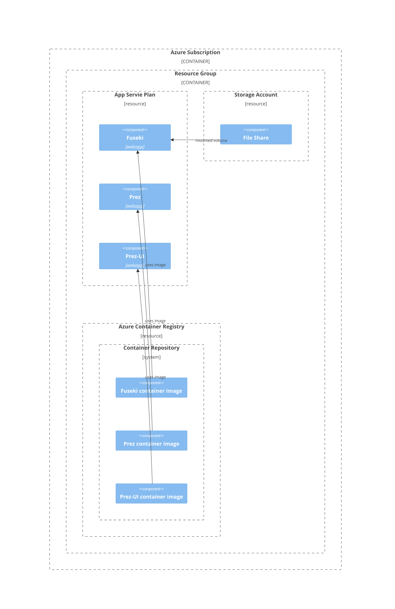

# Deploying Prez as an Azure App Service App

#prez #prezui #fuseki #azure #azure-app-service #containerapps 

This page will show you how to deploy Prez from container images to an Azure App Service App

## Overview of Azure and Prez components:

## Installation and Configuration

### 1. Create an Azure Container Registry (ACR) and push the images to it

The Prez system requires 3 container images to function, Prez, Prez-UI and a Triple Store (such as Fuseki).

Required Images:
1. ghcr.io/rdflib/prez-ui:latest
2. ghcr.io/rdflib/prez:latest
3. ghcr.io/zazuko/fuseki-geosparql:latest

> **Note**: A guide on creating an Azure Container Registry and adding images to it is available [here](https://learn.microsoft.com/en-us/azure/container-registry/container-registry-get-started-portal?tabs=azure-cli).

On upload of the containers you will be able to view them in the Azure portal under `Container Registries > your registry > Repositories`

### 2. Create the App Service Plan and Apps

An App Service Plan is required for billing and containment of the web apps. You can [create one yourself](https://learn.microsoft.com/en-us/azure/app-service/overview-hosting-plans) or have one automatically created when you set up the first web app.

App Service Plan (ASP) Requirements
`Minimum SKU: B2`

> **Note**: The App Service Plan can be easily scaled up if needed.

App Service Apps to Create:

1. Fuseki
2. Prez
3. Prez-UI

> **Note**: All three apps will share the same App Service Plan

> **Note**: It is recommended to create the apps in order to confirm that each one is operational before moving to the next one.

#### 2.1 Create the Fuseki Web App

Fuseki requires a file share to be mounted for persistent data storage. Configuration values can also be passed to Fuseki by placing a file called `config.ttl` into the root directory of the mounted storage.

Thus, the first step in deploying Fuseki is to create a file share.

1. Create a Storage Account and File Share ([instructions](https://learn.microsoft.com/en-us/azure/storage/files/storage-how-to-use-files-portal?tabs=azure-portal)).
2. Upload the Fuseki config file to the File Share.

> **Note**: The config file can be downloaded from [here](https://github.com/Kurrawong/demo-files/blob/1743824588e99ecbefa61ae00b1c7c6f85069d48/prez-deploy-azure-pipeline/config.ttl).

This config file defines a dataset called **myds** that is referenced later by Prez.
It also sets up a Full Text search index for the following predicates
`[definition, prefLabel, altLabel, label, identifier, description, comment, type, historyNote]`.  More can be added or removed to suit your needs.

3. Create the Fuseki Web App by following the [documentation](https://learn.microsoft.com/en-us/azure/app-service/quickstart-custom-container?tabs=dotnet&pivots=container-linux-azure-portal#3---deploy-to-azure).
4. Mount the File Share ([instructions](https://learn.microsoft.com/en-us/azure/app-service/configure-connect-to-azure-storage?tabs=basic%2Cportal&pivots=container-linux))

> __Note:__  The `Mount Path` must be set to `/fuseki` see below image for example.


5. Restart the app to read in the configuration values.

You should be able to browse the web app and confirm that the Fuseki Interface loads and presents a single dataset called `/myds`

> **Note**: see the section on [Troubleshooting](#Troubleshooting) for help if you run into any problems.

6. (optionally) Set the Fuseki admin password

> __Note:__ The default username and password for Fuseki is
> 	username: admin
> 	password: admin

To change the password you need to set the ADMIN_PASSWORD environment variable. See the section on [Setting Environment Variables](#Setting%20Environment%20Variables) for help.

#### 2.2 Configure the Prez Web App

1. Create the Web App by following the [documentation](https://learn.microsoft.com/en-us/azure/app-service/quickstart-custom-container?tabs=dotnet&pivots=container-linux-azure-portal#3---deploy-to-azure).
2. Set the required environment variables for Prez (see [Setting Environment Variables](#Setting%20Environment%20Variables) for help)
	`SPARQL_ENDPOINT: http://<fuseki public domain>/myds`
	`PORT: 8000`

> __Note:__ The trailing component of the SPARQL_ENDPOINT variable should be the same as the dataset name declared in Fuseki's `config.ttl` file. In this case `/myds`

You should now be able to browse the Prez web app and it will present you with a response in turtle.

> **Note**: see the section on [Troubleshooting](#Troubleshooting) for help if you run into any problems.

#### 2.3 Configure the Prez UI Web App

1. Create the Web App by following the [documentation](https://learn.microsoft.com/en-us/azure/app-service/quickstart-custom-container?tabs=dotnet&pivots=container-linux-azure-portal#3---deploy-to-azure).
2. Set the required environment variables (see [Setting Environment Variables](#Setting%20Environment%20Variables) for help)
	`VITE_ENABLED_PREZS: vocprez`
	`VITE_API_BASE_URL: http://<prez public domain>`
	`WEBSITES_PORT: 8000`

> __Note:__ `<prez public domain>` needs to be replaced with the public domain of the Prez web app that you configured in Section 2.2.

>__Note:__ The `WEBSITES_PORT` variable is a special variable used to open ports on the container. See [here](https://learn.microsoft.com/en-us/azure/app-service/configure-custom-container?tabs=debian&pivots=container-linux#configure-port-number) for details.

You should now be able to navigate to the Prez UI web app and view the Prez UI dashboard.

> **Note**: see the section on [Troubleshooting](#Troubleshooting) for help if you run into any problems.

## Troubleshooting

### Setting Environment Variables

Environment variables are passed to the container as App Settings.

App Settings can be configured using the az cli or the Azure Portal.

To set them with az cli:

```
> az webapp config appsettings set \
     --resource-group <group-name> \
     --name <app-name> \
     --settings SPARQL_ENDPOINT="http://<fuseki public domain/myds"
```

And to use the portal:


### Docker Logs

If the web apps are unreachable after start up, consult the Container Provision Logs under Deployment Center > Logs.


### Container Logs

If you need to access the logs from the container after it has been provisioned you will first have to turn on the __App Service logs__ (see below). Then you can view the container logs from the __Log Stream__ blade.


## Healthchecks

When deploying containerapps using a dedicated workload profile, Azure will apply some default
Healthchecks to your containerapp. These can cause issues if the startup time is longer than about
30 seconds.

More information and resolutions can be found at [this link](https://learn.microsoft.com/en-us/azure/container-apps/health-probes?tabs=arm-template#default-configuration).
