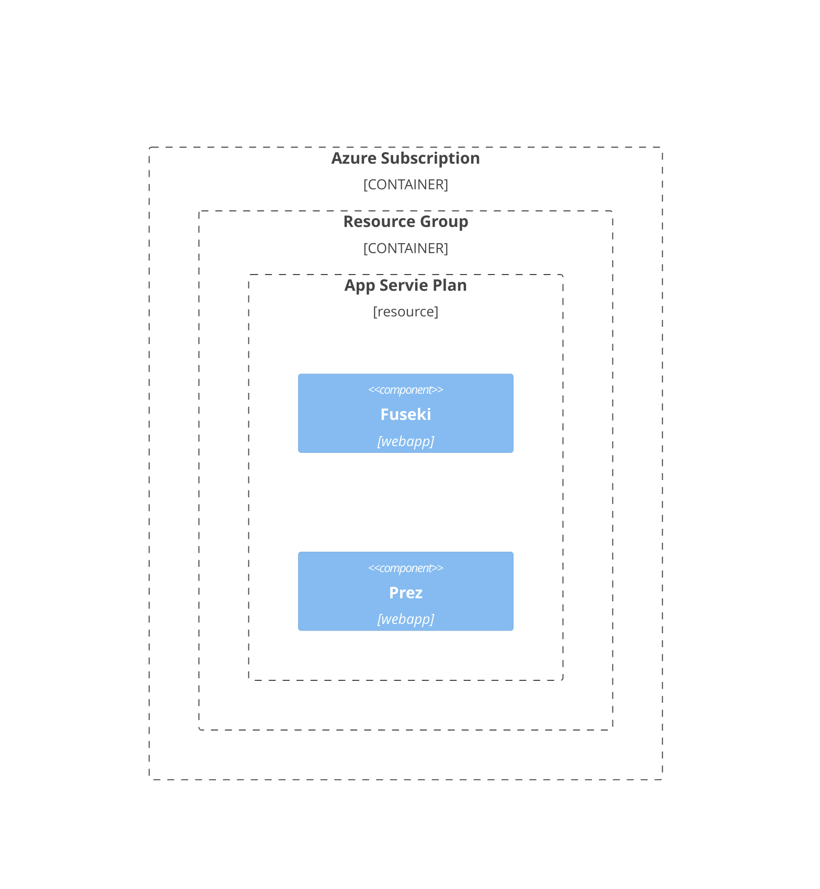

# Deploying Prez to Azure App Service

This page will show you how to deploy Prez to Azure App Service.

The following resources will be created:

Prez provides profiles of data from a knowledge graph, but is not a knowledge graph
itself. Thus, this guide uses Apache Jena Fuseki as the knowledge graph providing data
to Prez.

## Deployment Steps

### 1. Create the Fuseki Web App

The official Microsoft documentation is a good place to start if you have never created
a web app before. Specifically see the guide on how to [create a web app from a custom container image](https://learn.microsoft.com/en-us/azure/app-service/quickstart-custom-container?tabs=dotnet&pivots=container-linux-azure-portal#3---deploy-to-azure).

An App service Plan will be created for you to host the web app. It is recommended to
use the Basic B1 tier for this demo.

1. Create a new web app
2. Under the **Container** configuration section set the following values:

    | field               | value                                                                                                             |
    | ------------------- | ----------------------------------------------------------------------------------------------------------------- |
    | image source        | other container registries                                                                                        |
    | registry server URL | https://ghcr.io                                                                                                   |
    | image and tag       | kurrawong/fuseki-geosparql:latest                                                                                 |
    | startup command     | `/opt/java-minimal/bin/java -cp /opt/fuseki/fuseki-server.jar org.apache.jena.fuseki.cmd.FusekiCmd --mem /demods` |

    Startup command explanation:

    Execute the Java binary `/opt/java-minimal/bin/java`  
    Pass it the classpath of the Fuseki Server jar file `/opt/fuseki/fuseki-server.jar`  
    Pass the `--mem` flag to start with an in memory dataset called `/demods`

3. Review and create the web app.
4. Set the `WEBSITES_PORT` environment variable to `3030`

   _This tells the web app that the containerized application is listening for traffic on port 3030.
   The web app can then forward incoming requests (on port 443) to the correct port._

The following MS Learn module shows hot to set environment variables for your web app.
https://learn.microsoft.com/en-us/training/modules/configure-web-app-settings/2-configure-application-settings

Once the app is deployed you can open it in the web browser to navigate the admin
interface.

> [!IMPORTANT]  
> The default username and password for this Fuseki container is admin:admin

### 2. Create the Prez Web App

1. Create a new web app
2. Reuse the App Service plan you created for the Fuseki web app
3. Under the **Container** configuration section set the following values:

    | field               | value                                                                                                             |
    | ------------------- | ----------------------------------------------------------------------------------------------------------------- |
    | image source        | other container registries                                                                                        |
    | registry server URL | https://ghcr.io                                                                                                   |
    | image and tag       | rdflib/prez:latest                                                                                 |

2. Set the required environment variables

   | Variable        | value                                                |
   | --------------- | ---------------------------------------------------- |
   | SPARQL_ENDPOINT | https://**fuseki_app_name**.azurewebsites.net/demods |
   | WEBSITES_PORT   | 8000                                                 |

You should now be able to browse the Prez web app and it will present you with a response in turtle.

### 5. Complete

You have now deployed Prez as a web app on Azure app service.

#### Next steps

- Upload data to Fuseki using the admin portal,
- Explore the Prez API by browsing the `/docs` endpoint,
- Learn how to persist data to Fuseki by mounting a file share,
- Deploy Prez-UI for a graphical user interface on top of the Prez API data.
