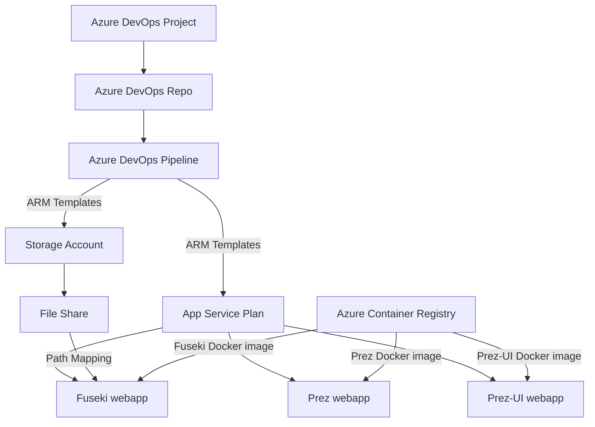
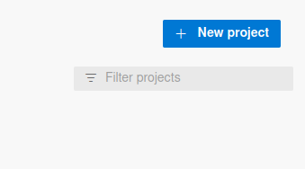
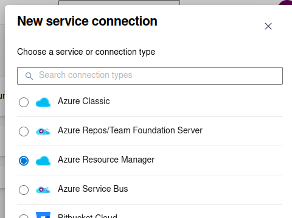
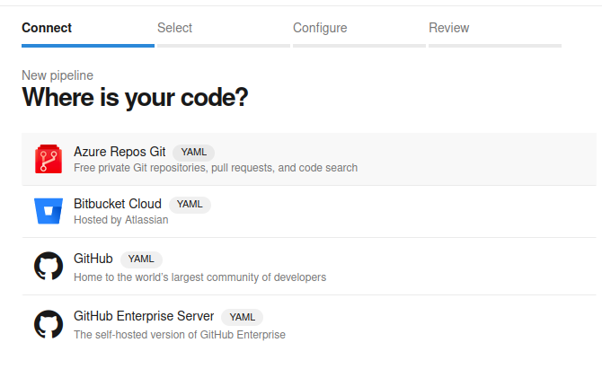
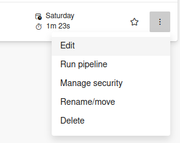

# Using Azure DevOps to Deploy Prez containers on Azure App Service
#azure #azure-app-service #devops #prez #prezui #fuseki #arm #pipeline

This guide will step through creating an Azure DevOps pipeline to deploy Prez, Prez-UI and Fuseki as custom containers on Azure App Service using ARM templates.

## Deployment Overview



## Prerequisites

- An active Azure subscription
- An Azure Container Registry (ACR) with the following Docker Images:
	- Fuseki
	- Prez
	- Prez UI

> **Note:** If you need instructions on setting up an ACR and adding images to it, see the first section of [Prez on AAS](appservice.md)

## Deployment Steps

1. Create a new DevOps **project**

	

2. Create a **Service Connection**
	1. Select **Project settings** from the bottom of the left menu.
	2. Select **Service connections** under **Pipelines**.
	3. Select **Create Service connection**, select **Azure Resource Manager**, and then select **Next**.
	4. Select **Service principal (automatic)**\*, and then select **Next**.
	5. Enter the following values:
	    - **Scope level**: select **Subscription**.
	    - **Subscription**: select your subscription.
	    - **Resource Group**: Leave it blank.
	    - **Connection name**: enter a connection name. For example, `prezDemoConnection`. Write down this name, you need the name when you create your pipeline.
	    - **Grant access permission to all pipelines**. (selected)
	6. Select **Save**.

    

    _If the Service Principal account creations fails, refer to the section titled [Creating a Service Principal Account (Manually)](#creating-a-service-principal-account-manually)_

3. Create a **Repository**
	1. **Initialise** it using the button with a README.md and .gitignore.

4. Create a **Pipeline**
	1. Select your Repository as the source.
	2. Create the sample pipeline and run it to make sure that it works.

    

5. Add **Pipeline Secrets**
	1. Open the Pipelines View (It should show your Recent Pipelines by default)
	2. Click on **Edit** from the ellipsis menu for your pipeline
	
	3. Click **Variables**
	4. Click **New Variable**
	5. Enter the following key value pairs
			_be sure to tick the box that says **Keep this value secret**_

		`ACR_USERNAME: <the admin username for your Azure Container Registry.`
		`ACR_PASSWORD: <the admin password for your Azure Container Regsitry`

	    > **Note:** The ACR admin username and password can be found in the Azure portal under `Settings > Access Keys` when viewing the ACR resource.

6. Clone the DevOps **repository**
7. Remove the `azure-pipelines.yml` file created by the sample pipeline
8. Download the sample files from GitHub:
	1. `azure-pipelines.yml`
	2. `deploy.json`
	3. `deploy.parameters.dev.json`
	4. `config.ttl`

	> **Note:** The files are available [here](https://github.com/Kurrawong/demo-files/tree/0229c9a7a15a8a22a7b5238110ece23bf6ac8211/prez-deploy-azure-pipeline)

9. **Copy the files** to your DevOps repository.
10. Open the `deploy.parameters.dev.json` file and fill in the parameter values.
		_you will need to remove all the comments from the file before pushing_

	```json
	{
	...
	
	"parameters": {
	  "STGname": {
		"value": "" // Name for the Storage Account
	  },
	  "FSname": {
		"value": "" // Name for the File share to mount to the fuseki container.
	  },
	
	...
	```

11. Open the `azure-pipelines.yml` file and provide values for the following variables:
    * `azureServiceConnection`
	* `resourceGroupName`
	* `location`

	```yaml
	...
	
	variables:
	  ...
	  azureServiceConnection: '<service connection name'
	  resourceGroupName: '<rg name>'
	  location: '<location>'
	
	...
	```

12. **Commit and Push the new files** to the Azure DevOps Repository.
		This should trigger a pipeline run to create the resources.

You can check the status of the pipeline run from the DevOps portal.

If you run into trouble, check the pipeline logs for details of where the deployment went wrong. Common issues and their solutions can be found in the [Troubleshooting](#troubleshooting) section.

## Troubleshooting

### Common Issues
- Make sure the Service Principal account you have used has the right permissions.
- Make sure to remove all comments from the parameters file.
- Make sure you have set the Pipeline Secrets.

### Tips
You can add the `--debug` flag to the end of the `az deployment group create` command in the `azure-pipelines.yml` file to get more detailed output in the pipeline logs.


### Creating a Service Principal Account (Manually)

To create a Service Principal account you will need help from someone with the **Owner** or **User Access Administrator** role for the subscription you intend to create resources in.

To create the account run the following command:

```bash
> az ad sp create-fpr-rbac --name <sp_name> --role contributor --scope /subscriptions/<sub_id>
```

> __Note:__ `az` commands can be run from the azure cloud shell or from any machine where the [az cli](https://learn.microsoft.com/en-us/cli/azure/) is installed.

Be sure to substitute the placeholders with appropriate values

| placeholder | details                                                           |
| ----------- | ----------------------------------------------------------------- |
| `<sp_name>` | Provide a name for the Service Principal Account                  |
| `<sub_id>`  | ID of the subscription to create the service principal account in |

> __Note:__ for all the available parameters see: <https://learn.microsoft.com/en-us/cli/azure/ad/sp?view=azure-cli-latest#az-ad-sp-create-for-rbac>

This will create a new Service Principal account with the contributor role for the specified subscription. This authorizes the account to create and manage resources inside that subscription.

After it is created you will need to get the **appID**, **password**, and **tenantID** associated with the new Service Principal account and pass them into the form after Step 4 of the **Create a Service Connection** Instructions. Noting that you will need to select **service principal (manual)** instead of **service principal (automatic)**.

For more information on creating the account, see this article: <https://azuredevopslabs.com/labs/devopsserver/azureserviceprincipal/>
